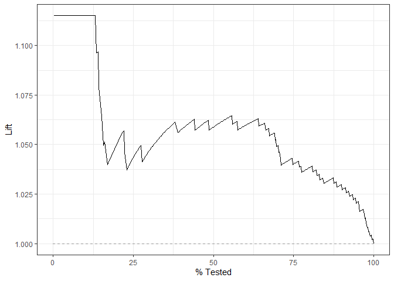
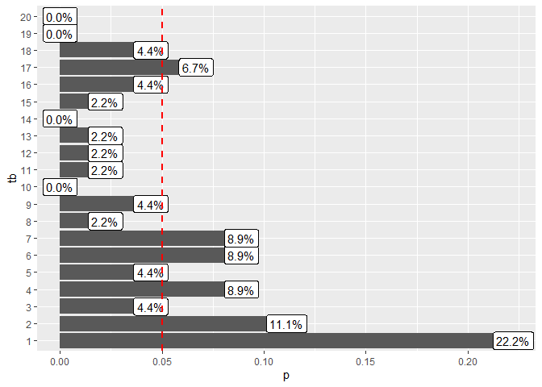

<!-- README.md is generated from README.Rmd. Please edit that file -->

# Tuberculo Bovina

### Carregando os pacotes

``` r
library(tidymodels)
library(ISLR)
library(tidyverse)
library(modeldata)
library(pROC)
library(vip)
library(readxl)
```

### Entrada de dados

``` r
tbsp <- read_excel("data-raw/TBSP_outubro.xls") |> 
  mutate(TB = forcats::as_factor(TB))
glimpse(tbsp)
#> Rows: 1,743
#> Columns: 40
#> $ id             <dbl> 1, 2, 3, 4, 5, 6, 7, 8, 9, 10, 11, 12, 13, 14, 15, 16, ~
#> $ cod_mun        <dbl> 3500105, 3500105, 3500105, 3500808, 3500808, 3501103, 3~
#> $ TB             <fct> 0, 0, 0, 0, 0, 0, 1, 0, 0, 0, 0, 0, 0, 0, 0, 0, 0, 0, 0~
#> $ reb_ma_19      <dbl> 1, 1, 0, 0, 0, 1, 0, 0, 0, 1, 1, 1, 0, 1, 1, 0, 1, 0, 1~
#> $ tipo_exp       <dbl> 1, 1, 2, 1, 1, 1, 1, 3, 3, 1, 1, 1, 1, 2, 2, 2, 1, 2, 2~
#> $ tipo_cria      <dbl> 1, 1, 1, 1, 1, 1, 1, 1, 1, 1, 1, 1, 1, 1, 1, 1, 1, 1, 1~
#> $ n_ordenha      <dbl> 1, 1, 2, 1, 1, 1, 1, 2, 2, 1, 1, 1, 1, 3, 2, 2, 1, 2, 2~
#> $ tipo_ordenha   <dbl> 1, 1, 4, 1, 1, 1, 1, 4, 4, 1, 1, 1, 1, 4, 4, 4, 1, 4, 4~
#> $ n_vacas        <dbl> 0, 0, 4, 0, 0, 0, 0, 4, 1, 0, 0, 0, 0, 20, 15, 6, 0, 5,~
#> $ prod_diaria    <dbl> 0, 0, 30, 0, 0, 0, 0, 5, 5, 0, 0, 0, 0, 150, 60, 40, 0,~
#> $ inseminacao    <dbl> 1, 1, 1, 1, 1, 1, 1, 1, 1, 1, 1, 1, 1, 1, 1, 1, 1, 1, 1~
#> $ raca_bov       <dbl> 1, 1, 5, 1, 4, 4, 4, 4, 4, 1, 4, 1, 1, 4, 4, 4, 4, 4, 4~
#> $ ovi_cap        <dbl> 0, 0, 0, 0, 0, 1, 0, 1, 0, 0, 0, 0, 0, 0, 0, 0, 0, 0, 0~
#> $ equi           <dbl> 1, 1, 0, 1, 1, 1, 1, 1, 1, 1, 1, 0, 1, 1, 1, 0, 0, 1, 1~
#> $ sui            <dbl> 0, 0, 1, 0, 0, 0, 0, 1, 0, 1, 0, 0, 1, 0, 1, 1, 0, 0, 0~
#> $ aves           <dbl> 0, 0, 0, 1, 0, 1, 0, 1, 1, 1, 1, 0, 1, 1, 1, 1, 0, 1, 1~
#> $ cao            <dbl> 1, 1, 0, 1, 0, 1, 0, 1, 0, 1, 1, 0, 1, 1, 1, 0, 0, 1, 1~
#> $ gato           <dbl> 0, 0, 0, 0, 1, 1, 0, 1, 0, 1, 0, 0, 0, 1, 1, 0, 0, 1, 0~
#> $ nsilvestre     <dbl> 0, 0, 0, 0, 1, 0, 1, 1, 0, 0, 1, 1, 0, 0, 0, 0, 1, 0, 0~
#> $ cervideo       <dbl> 0, 0, 0, 0, 0, 0, 0, 0, 0, 0, 0, 0, 0, 0, 0, 0, 0, 0, 0~
#> $ capivara       <dbl> 0, 0, 0, 0, 0, 0, 1, 1, 0, 0, 0, 1, 0, 0, 0, 0, 0, 0, 0~
#> $ felideos       <dbl> 0, 0, 0, 0, 0, 0, 0, 0, 0, 0, 0, 0, 0, 0, 0, 0, 1, 0, 0~
#> $ marsu          <dbl> 0, 0, 0, 0, 0, 0, 0, 1, 0, 0, 1, 0, 0, 0, 0, 0, 1, 0, 0~
#> $ macaco         <dbl> 0, 0, 0, 0, 0, 0, 0, 0, 0, 0, 0, 0, 0, 0, 0, 0, 1, 0, 0~
#> $ outra_silv     <dbl> 0, 0, 0, 0, 1, 0, 1, 1, 0, 0, 0, 0, 0, 0, 0, 0, 0, 0, 0~
#> $ testa_tb       <dbl> 0, 0, 0, 0, 0, 0, 1, 0, 0, 0, 0, 0, 1, 0, 0, 0, 0, 0, 0~
#> $ regul_test_tb  <dbl> 0, 0, 0, 0, 0, 0, 4, 0, 0, 0, 0, 0, 4, 0, 0, 0, 0, 0, 0~
#> $ aquis_bovideos <dbl> 1, 0, 0, 1, 0, 1, 0, 0, 1, 0, 1, 0, 0, 1, 0, 0, 1, 0, 1~
#> $ aluga_pasto    <dbl> 0, 0, 0, 1, 0, 1, 0, 0, 1, 0, 1, 0, 1, 1, 0, 0, 0, 0, 0~
#> $ pasto_comum    <dbl> 0, 0, 0, 1, 0, 0, 0, 0, 0, 0, 0, 1, 0, 0, 0, 0, 0, 0, 0~
#> $ comp_itens     <dbl> 0, 0, 0, 0, 0, 0, 1, 0, 0, 0, 1, 1, 0, 1, 0, 0, 0, 0, 1~
#> $ areas_alagadas <dbl> 0, 0, 0, 0, 0, 0, 1, 1, 0, 0, 1, 0, 0, 0, 0, 1, 0, 0, 0~
#> $ gado_conc      <dbl> 0, 0, 0, 0, 0, 0, 0, 0, 0, 0, 0, 0, 1, 0, 0, 0, 0, 0, 0~
#> $ piquete_parto  <dbl> 0, 0, 0, 1, 0, 0, 0, 0, 0, 0, 0, 1, 0, 0, 0, 0, 0, 0, 0~
#> $ entr_leite     <dbl> 0, 0, 1, 0, 0, 0, 0, 0, 0, 0, 0, 0, 0, 1, 1, 0, 0, 1, 0~
#> $ lact_venda     <dbl> 0, 0, 0, 0, 0, 0, 0, 0, 0, 0, 0, 0, 0, 0, 0, 1, 0, 0, 0~
#> $ assis_vet      <dbl> 0, 0, 0, 1, 1, 0, 0, 1, 0, 1, 1, 1, 1, 0, 0, 0, 0, 1, 0~
#> $ alim_soro      <dbl> 0, 0, 0, 0, 0, 0, 0, 0, 0, 0, 0, 0, 0, 0, 0, 0, 0, 0, 0~
#> $ comp_aguada    <dbl> 0, 1, 1, 0, 0, 0, 0, 1, 1, 1, 1, 1, 0, 0, 0, 0, 0, 0, 0~
#> $ classif_prop   <dbl> 1, 1, 1, 1, 1, 1, 1, 1, 4, 1, 1, 1, 1, 3, 1, 1, 1, 3, 1~
tbsp |> count(TB)
#> # A tibble: 2 x 2
#>   TB        n
#>   <fct> <int>
#> 1 0      1570
#> 2 1       173
```

### Definindo a base de treino e a base de teste

``` r
set.seed(1)
tbsp_initial_split <- initial_split(tbsp, strata = "TB", prop = 0.75)

tbsp_train <- training(tbsp_initial_split)
tbsp_train |> count(TB)
#> # A tibble: 2 x 2
#>   TB        n
#>   <fct> <int>
#> 1 0      1179
#> 2 1       128
tbsp_test  <- testing(tbsp_initial_split)
tbsp_test |> count(TB)
#> # A tibble: 2 x 2
#>   TB        n
#>   <fct> <int>
#> 1 0       391
#> 2 1        45
```

### Análise exploratória dos dados

``` r
skimr::skim(tbsp_train)
```

|                                                  |             |
|:-------------------------------------------------|:------------|
| Name                                             | tbsp\_train |
| Number of rows                                   | 1307        |
| Number of columns                                | 40          |
| \_\_\_\_\_\_\_\_\_\_\_\_\_\_\_\_\_\_\_\_\_\_\_   |             |
| Column type frequency:                           |             |
| factor                                           | 1           |
| numeric                                          | 39          |
| \_\_\_\_\_\_\_\_\_\_\_\_\_\_\_\_\_\_\_\_\_\_\_\_ |             |
| Group variables                                  | None        |

Data summary

**Variable type: factor**

| skim\_variable | n\_missing | complete\_rate | ordered | n\_unique | top\_counts     |
|:---------------|-----------:|---------------:|:--------|----------:|:----------------|
| TB             |          0 |              1 | FALSE   |         2 | 0: 1179, 1: 128 |

**Variable type: numeric**

| skim\_variable  | n\_missing | complete\_rate |       mean |       sd |      p0 |       p25 |     p50 |     p75 |    p100 | hist  |
|:----------------|-----------:|---------------:|-----------:|---------:|--------:|----------:|--------:|--------:|--------:|:------|
| id              |          0 |              1 |     869.38 |   504.18 |       1 |     435.5 |     863 |    1307 |    1743 | ▇▇▇▇▇ |
| cod\_mun        |          0 |              1 | 3528956.22 | 16329.82 | 3500105 | 3514858.5 | 3529302 | 3542701 | 3557204 | ▇▇▇▇▇ |
| reb\_ma\_19     |          0 |              1 |       0.29 |     0.45 |       0 |       0.0 |       0 |       1 |       1 | ▇▁▁▁▃ |
| tipo\_exp       |          0 |              1 |       1.91 |     0.79 |       1 |       1.0 |       2 |       3 |       3 | ▇▁▇▁▆ |
| tipo\_cria      |          0 |              1 |       1.15 |     0.38 |       1 |       1.0 |       1 |       1 |       3 | ▇▁▁▁▁ |
| n\_ordenha      |          0 |              1 |       1.68 |     0.61 |       1 |       1.0 |       2 |       2 |       3 | ▆▁▇▁▁ |
| tipo\_ordenha   |          0 |              1 |       2.73 |     1.43 |       1 |       1.0 |       4 |       4 |       4 | ▆▁▁▁▇ |
| n\_vacas        |          0 |              1 |       4.96 |    10.17 |       0 |       0.0 |       1 |       5 |     160 | ▇▁▁▁▁ |
| prod\_diaria    |          0 |              1 |      35.43 |   101.86 |       0 |       0.0 |       5 |      25 |    1600 | ▇▁▁▁▁ |
| inseminacao     |          0 |              1 |       1.09 |     0.35 |       1 |       1.0 |       1 |       1 |       3 | ▇▁▁▁▁ |
| raca\_bov       |          0 |              1 |       3.21 |     1.36 |       0 |       2.0 |       4 |       4 |       5 | ▃▁▁▇▁ |
| ovi\_cap        |          0 |              1 |       0.15 |     0.35 |       0 |       0.0 |       0 |       0 |       1 | ▇▁▁▁▂ |
| equi            |          0 |              1 |       0.71 |     0.45 |       0 |       0.0 |       1 |       1 |       1 | ▃▁▁▁▇ |
| sui             |          0 |              1 |       0.33 |     0.47 |       0 |       0.0 |       0 |       1 |       1 | ▇▁▁▁▃ |
| aves            |          0 |              1 |       0.68 |     0.47 |       0 |       0.0 |       1 |       1 |       1 | ▃▁▁▁▇ |
| cao             |          0 |              1 |       0.79 |     0.40 |       0 |       1.0 |       1 |       1 |       1 | ▂▁▁▁▇ |
| gato            |          0 |              1 |       0.41 |     0.49 |       0 |       0.0 |       0 |       1 |       1 | ▇▁▁▁▆ |
| nsilvestre      |          0 |              1 |       0.60 |     0.49 |       0 |       0.0 |       1 |       1 |       1 | ▆▁▁▁▇ |
| cervideo        |          0 |              1 |       0.11 |     0.31 |       0 |       0.0 |       0 |       0 |       1 | ▇▁▁▁▁ |
| capivara        |          0 |              1 |       0.24 |     0.42 |       0 |       0.0 |       0 |       0 |       1 | ▇▁▁▁▂ |
| felideos        |          0 |              1 |       0.12 |     0.33 |       0 |       0.0 |       0 |       0 |       1 | ▇▁▁▁▁ |
| marsu           |          0 |              1 |       0.41 |     0.49 |       0 |       0.0 |       0 |       1 |       1 | ▇▁▁▁▆ |
| macaco          |          0 |              1 |       0.24 |     0.42 |       0 |       0.0 |       0 |       0 |       1 | ▇▁▁▁▂ |
| outra\_silv     |          0 |              1 |       0.14 |     0.35 |       0 |       0.0 |       0 |       0 |       1 | ▇▁▁▁▂ |
| testa\_tb       |          0 |              1 |       0.13 |     0.34 |       0 |       0.0 |       0 |       0 |       1 | ▇▁▁▁▁ |
| regul\_test\_tb |          0 |              1 |       0.31 |     0.92 |       0 |       0.0 |       0 |       0 |       4 | ▇▁▁▁▁ |
| aquis\_bovideos |          0 |              1 |       0.42 |     0.49 |       0 |       0.0 |       0 |       1 |       1 | ▇▁▁▁▆ |
| aluga\_pasto    |          0 |              1 |       0.17 |     0.38 |       0 |       0.0 |       0 |       0 |       1 | ▇▁▁▁▂ |
| pasto\_comum    |          0 |              1 |       0.15 |     0.35 |       0 |       0.0 |       0 |       0 |       1 | ▇▁▁▁▂ |
| comp\_itens     |          0 |              1 |       0.16 |     0.37 |       0 |       0.0 |       0 |       0 |       1 | ▇▁▁▁▂ |
| areas\_alagadas |          0 |              1 |       0.31 |     0.46 |       0 |       0.0 |       0 |       1 |       1 | ▇▁▁▁▃ |
| gado\_conc      |          0 |              1 |       0.08 |     0.27 |       0 |       0.0 |       0 |       0 |       1 | ▇▁▁▁▁ |
| piquete\_parto  |          0 |              1 |       0.20 |     0.40 |       0 |       0.0 |       0 |       0 |       1 | ▇▁▁▁▂ |
| entr\_leite     |          0 |              1 |       0.25 |     0.44 |       0 |       0.0 |       0 |       1 |       1 | ▇▁▁▁▃ |
| lact\_venda     |          0 |              1 |       0.03 |     0.17 |       0 |       0.0 |       0 |       0 |       1 | ▇▁▁▁▁ |
| assis\_vet      |          0 |              1 |       0.33 |     0.47 |       0 |       0.0 |       0 |       1 |       1 | ▇▁▁▁▃ |
| alim\_soro      |          0 |              1 |       0.01 |     0.08 |       0 |       0.0 |       0 |       0 |       1 | ▇▁▁▁▁ |
| comp\_aguada    |          0 |              1 |       0.17 |     0.37 |       0 |       0.0 |       0 |       0 |       1 | ▇▁▁▁▂ |
| classif\_prop   |          0 |              1 |       1.30 |     0.84 |       1 |       1.0 |       1 |       1 |       4 | ▇▁▁▁▁ |

``` r
visdat::vis_miss(tbsp_train)
```

<!-- -->

``` r
tbsp_train  |> 
   select(where(is.numeric))  |> 
   cor()  |> 
   corrplot::corrplot()
```

<!-- -->

# Regressão Logística (não é Machine Learning…)

## Data Prep

``` r
tbsp_recipe <- recipe(TB ~ ., data = tbsp_train |> 
                        select(-id, -cod_mun)
                      ) |> 
  step_normalize(all_numeric_predictors())  |> 
  step_novel(all_nominal_predictors()) |> 
  step_zv(all_predictors()) |> 
  # step_poly(c(n_vacas, prod_diaria), degree = 9)  |> 
  step_dummy(all_nominal_predictors())

bake(prep(tbsp_recipe), new_data = NULL)
#> # A tibble: 1,307 x 38
#>    reb_ma_19 tipo_exp tipo_cria n_ordenha tipo_ordenha n_vacas prod_diaria
#>        <dbl>    <dbl>     <dbl>     <dbl>        <dbl>   <dbl>       <dbl>
#>  1     1.56    -1.15     -0.387    -1.12        -1.20  -0.487      -0.348 
#>  2    -0.639   -1.15     -0.387    -1.12        -1.20  -0.487      -0.348 
#>  3    -0.639   -1.15     -0.387    -1.12        -1.20  -0.487      -0.348 
#>  4    -0.639   -1.15     -0.387    -1.12        -1.20  -0.487      -0.348 
#>  5    -0.639    1.37     -0.387     0.533        0.888 -0.0940     -0.299 
#>  6    -0.639    1.37     -0.387     0.533        0.888 -0.389      -0.299 
#>  7    -0.639   -1.15     -0.387    -1.12        -1.20  -0.487      -0.348 
#>  8     1.56     0.109    -0.387     2.18         0.888  1.48        1.12  
#>  9     1.56     0.109    -0.387     0.533        0.888  0.988       0.241 
#> 10    -0.639    0.109    -0.387     0.533        0.888  0.103       0.0449
#> # ... with 1,297 more rows, and 31 more variables: inseminacao <dbl>,
#> #   raca_bov <dbl>, ovi_cap <dbl>, equi <dbl>, sui <dbl>, aves <dbl>,
#> #   cao <dbl>, gato <dbl>, nsilvestre <dbl>, cervideo <dbl>, capivara <dbl>,
#> #   felideos <dbl>, marsu <dbl>, macaco <dbl>, outra_silv <dbl>,
#> #   testa_tb <dbl>, regul_test_tb <dbl>, aquis_bovideos <dbl>,
#> #   aluga_pasto <dbl>, pasto_comum <dbl>, comp_itens <dbl>,
#> #   areas_alagadas <dbl>, gado_conc <dbl>, piquete_parto <dbl>, ...
visdat::vis_miss(bake(prep(tbsp_recipe), new_data = NULL))
```

<!-- -->

### Modelo

#### Definição de

1.  a f(x): logistc\_reg()

2.  modo (natureza da var resp): classification

3.  hiperparametros a tunar: penalty = tune()

4.  hiperparametros não tunado: mixture = 1 \# LASSO

5.  o motor que queremos usar: glmnet

``` r
tbsp_lr_model <- logistic_reg(penalty = tune(), mixture = 1)  |> 
  set_mode("classification") |> 
  set_engine("glmnet")
```

# Workflow

``` r
tbsp_wf <- workflow()  |> 
  add_model(tbsp_lr_model) |> 
  add_recipe(tbsp_recipe)
```

## Tunagem (tune)

1.  bases de reamostragem para validação: vfold\_cv()

2.  (opcional) grade de parâmetros: parameters() %&gt;% update() %&gt;%
    grid\_regular()

3.  tune\_grid(y \~ x + …)

4.  escolha das métricas (rmse, roc\_auc, etc)

5.  collect\_metrics() ou autoplot() para ver o resultado

``` r
tbsp_resamples <- vfold_cv(tbsp_train, v = 5, strata = "TB")
grid <- grid_regular(
  penalty(range = c(-4, -2)),
  levels = 20
)
```

``` r
tbsp_lr_tune_grid <- tune_grid(
  tbsp_wf,
  resamples = tbsp_resamples,
  grid = grid,
  metrics = metric_set(
    mn_log_loss, #binary cross entropy
    accuracy,
    roc_auc,
    # kap, # KAPPA
    precision,
    # recall,
    # f_meas,
  )
)
# autoplot(tbsp_lr_tune_grid)
```

``` r
collect_metrics(tbsp_lr_tune_grid)
#> # A tibble: 80 x 7
#>     penalty .metric     .estimator  mean     n std_err .config              
#>       <dbl> <chr>       <chr>      <dbl> <int>   <dbl> <chr>                
#>  1 0.0001   accuracy    binary     0.895     5 0.00664 Preprocessor1_Model01
#>  2 0.0001   mn_log_loss binary     0.319     5 0.0157  Preprocessor1_Model01
#>  3 0.0001   precision   binary     0.903     5 0.00612 Preprocessor1_Model01
#>  4 0.0001   roc_auc     binary     0.645     5 0.0204  Preprocessor1_Model01
#>  5 0.000127 accuracy    binary     0.895     5 0.00664 Preprocessor1_Model02
#>  6 0.000127 mn_log_loss binary     0.319     5 0.0157  Preprocessor1_Model02
#>  7 0.000127 precision   binary     0.903     5 0.00612 Preprocessor1_Model02
#>  8 0.000127 roc_auc     binary     0.645     5 0.0204  Preprocessor1_Model02
#>  9 0.000162 accuracy    binary     0.895     5 0.00664 Preprocessor1_Model03
#> 10 0.000162 mn_log_loss binary     0.319     5 0.0157  Preprocessor1_Model03
#> # ... with 70 more rows
collect_metrics(tbsp_lr_tune_grid)  |> 
  ggplot(aes(x = penalty, y = mean)) +
  geom_point() +
  geom_ribbon(aes(ymin = mean - std_err, ymax = mean + std_err), alpha = 0.1) +
  facet_wrap(~.metric, ncol = 2, scales = "free_y") +
  scale_x_log10()
```

<!-- -->

# Desempenho do modelo final

1.  extrai melhor modelo com select\_best()

2.  finaliza o modelo inicial com finalize\_model()

3.  ajusta o modelo final com todos os dados de treino (a base de
    validação é incorporada)

``` r
tbsp_lr_best_params <- select_best(tbsp_lr_tune_grid, "roc_auc")
tbsp_wf <- tbsp_wf |> finalize_workflow(tbsp_lr_best_params)

tbsp_lr_last_fit <- last_fit(
  tbsp_wf,
  tbsp_initial_split
)

# Variáveis importantes
tbsp_lr_last_fit_model <- tbsp_lr_last_fit$.workflow[[1]]$fit$fit
vip(tbsp_lr_last_fit_model)
```

<!-- -->

# Guardar tudo

``` r
write_rds(tbsp_lr_last_fit, "data/tbsp_lr_last_fit.rds")
write_rds(tbsp_lr_model, "data/tbsp_lr_model.rds")
collect_metrics(tbsp_lr_last_fit)
#> # A tibble: 2 x 4
#>   .metric  .estimator .estimate .config             
#>   <chr>    <chr>          <dbl> <chr>               
#> 1 accuracy binary         0.899 Preprocessor1_Model1
#> 2 roc_auc  binary         0.714 Preprocessor1_Model1
tbsp_test_preds <- collect_predictions(tbsp_lr_last_fit)
```

## roc

``` r
tbsp_roc_curve <- tbsp_test_preds  |>  roc_curve(TB, .pred_0)
autoplot(tbsp_roc_curve)
```

<!-- -->

``` r
tbsp_lift_curve <- tbsp_test_preds  |>  lift_curve(TB, .pred_0)
autoplot(tbsp_lift_curve)
```

<!-- -->

### Matriz de Confusão

``` r
tbsp_test_preds <- tbsp_test_preds |> 
  mutate(
    TB_class = factor(if_else(.pred_0 > 0.9, "0", "1"))
  ) 
levels(tbsp_test_preds$ TB)
#> [1] "0" "1"
levels(tbsp_test_preds$ TB_class)
#> [1] "0" "1"
tbsp_test_preds |> conf_mat(TB, TB_class)
#>           Truth
#> Prediction   0   1
#>          0 288  18
#>          1 103  27
```

## risco por faixa de TB

``` r
tbsp_test_preds  |> 
  mutate(
    tb =  factor(ntile(.pred_0, 10))
  ) |> 
  count(tb, TB) %>%
  ggplot(aes(x = tb, y = n, fill = TB)) +
  geom_col(position = "fill") +
  geom_label(aes(label = n), position = "fill") +
  coord_flip()
```

<!-- -->

## gráfico sobre os da classe 1

``` r
percentis = 20
tbsp_test_preds |> 
  mutate(
    tb = factor(ntile(.pred_0, percentis))
  ) |> 
  filter(TB == 1)  |> 
  group_by(tb, .drop = FALSE)  |> 
  summarise(
    n = n(),
    media = mean(.pred_0)
  ) |> 
  mutate(p = n/sum(n)) |> 
  ggplot(aes(x = p, y = tb)) +
  geom_col() +
  geom_label(aes(label = scales::percent(p))) +
  geom_vline(xintercept = 1/percentis, colour = "red", linetype = "dashed", size = 1)
```

<!-- -->

# Árvore de decisão

## Data prep

``` r
tbsp_dt_recipe <- recipe(TB ~ ., data = tbsp_train)  |> 
  step_novel(all_nominal_predictors()) |> 
  step_zv(all_predictors())
```

## Modelo

``` r
tbsp_dt_model <- decision_tree(
  cost_complexity = tune(),
  tree_depth = tune(),
  min_n = tune()
)  |> 
  set_mode("classification")  |> 
  set_engine("rpart")
```

## Workflow

``` r
tbsp_dt_wf <- workflow()  |> 
  add_model(tbsp_dt_model) |> 
  add_recipe(tbsp_dt_recipe)
```

## Tune

``` r
grid_dt <- grid_random(
  cost_complexity(c(-9, -2)),
  tree_depth(range = c(5, 15)),
  min_n(range = c(20, 40)),
  size = 20
)
```

``` r
tbsp_dt_tune_grid <- tune_grid(
  tbsp_dt_wf,
  resamples = tbsp_resamples,
  grid = grid_dt,
  metrics = metric_set(roc_auc)
)
#> Warning: package 'rpart' was built under R version 4.1.1
```

``` r
autoplot(tbsp_dt_tune_grid)
```

<!-- -->

``` r
collect_metrics(tbsp_dt_tune_grid)
#> # A tibble: 20 x 9
#>    cost_complexity tree_depth min_n .metric .estimator  mean     n std_err
#>              <dbl>      <int> <int> <chr>   <chr>      <dbl> <int>   <dbl>
#>  1   0.0000000394          14    34 roc_auc binary     0.588     5 0.0259 
#>  2   0.00000000210         12    30 roc_auc binary     0.609     5 0.0165 
#>  3   0.00414                8    31 roc_auc binary     0.589     5 0.0258 
#>  4   0.00000000437         14    22 roc_auc binary     0.634     5 0.0141 
#>  5   0.000591              10    37 roc_auc binary     0.587     5 0.0276 
#>  6   0.000000182            5    26 roc_auc binary     0.609     5 0.0164 
#>  7   0.00000000200         11    21 roc_auc binary     0.635     5 0.0144 
#>  8   0.00000171             9    37 roc_auc binary     0.587     5 0.0276 
#>  9   0.000000872           10    34 roc_auc binary     0.588     5 0.0259 
#> 10   0.0000304              6    35 roc_auc binary     0.589     5 0.0262 
#> 11   0.0000865              6    39 roc_auc binary     0.587     5 0.0276 
#> 12   0.0000938             14    37 roc_auc binary     0.587     5 0.0276 
#> 13   0.00000650            14    24 roc_auc binary     0.655     5 0.0115 
#> 14   0.00000240            11    35 roc_auc binary     0.589     5 0.0262 
#> 15   0.000868               9    37 roc_auc binary     0.587     5 0.0276 
#> 16   0.000000671            8    24 roc_auc binary     0.667     5 0.00817
#> 17   0.000000936            6    22 roc_auc binary     0.622     5 0.0190 
#> 18   0.00000000269          5    30 roc_auc binary     0.609     5 0.0165 
#> 19   0.000000538            7    20 roc_auc binary     0.649     5 0.0149 
#> 20   0.000253              13    32 roc_auc binary     0.588     5 0.0259 
#> # ... with 1 more variable: .config <chr>
```

## Desempenho dos modelos finais

``` r
tbsp_lr_best_params <- select_best(tbsp_lr_tune_grid, "roc_auc")
tbsp_lr_wf <- tbsp_wf  |>  finalize_workflow(tbsp_lr_best_params)
tbsp_lr_last_fit <- last_fit(tbsp_lr_wf, tbsp_initial_split)
```

``` r
tbsp_dt_best_params <- select_best(tbsp_dt_tune_grid, "roc_auc")
tbsp_dt_wf <- tbsp_dt_wf %>% finalize_workflow(tbsp_dt_best_params)
tbsp_dt_last_fit <- last_fit(tbsp_dt_wf, tbsp_initial_split)
```

``` r
tbsp_test_preds <- bind_rows(
  collect_predictions(tbsp_lr_last_fit) |>  mutate(modelo = "lr"),
  collect_predictions(tbsp_dt_last_fit) |>  mutate(modelo = "dt")
)
```

``` r
## roc
tbsp_test_preds  |> 
  group_by(modelo)  |> 
  roc_curve(TB, .pred_0)  |> 
  autoplot()
```

<!-- -->

``` r
## lift
tbsp_test_preds  |> 
  group_by(modelo)  |> 
  lift_curve(TB, .pred_0)  |> 
  autoplot()
```

<!-- -->

# Variáveis importantes Regressão Logística

``` r
tbspt_lr_last_fit_model <- tbsp_lr_last_fit$.workflow[[1]]$fit$fit
vip(tbsp_lr_last_fit_model)
```

<!-- -->

# Árvore de Decisão

``` r
tbsp_dt_last_fit_model <- tbsp_dt_last_fit$.workflow[[1]]$fit$fit
vip(tbsp_dt_last_fit_model)
```

<!-- -->

``` r
# Guardar tudo ------------------------------------------------------------

write_rds(tbsp_dt_last_fit, "tbsp_dt_last_fit.rds")
write_rds(tbsp_dt_model, "tbsp_dt_model.rds")

# Modelo final ------------------------------------------------------------

tbsp_final_dt_model <- tbsp_dt_wf  |>  fit(tbsp)
```
