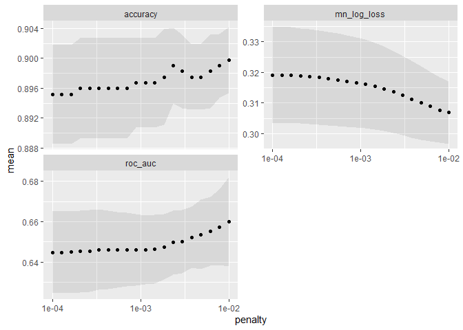
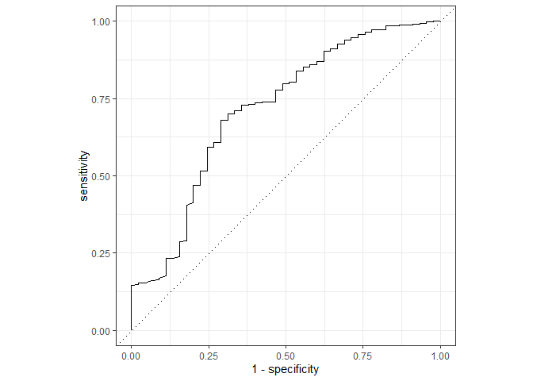
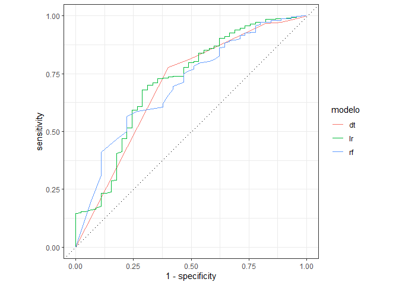
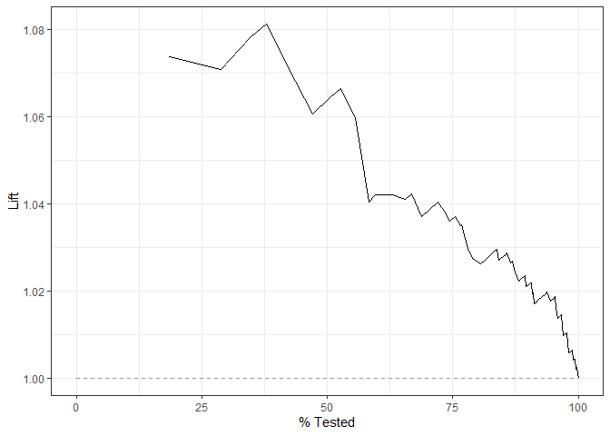
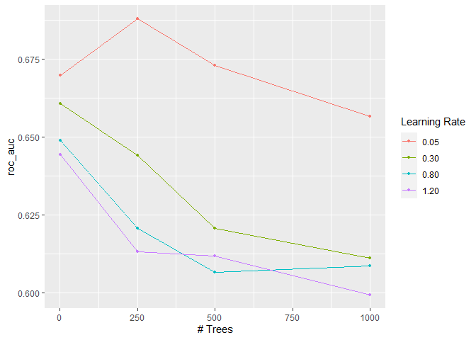
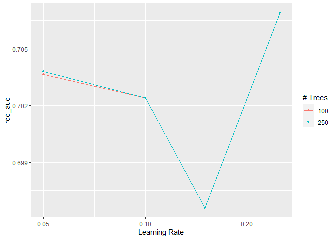
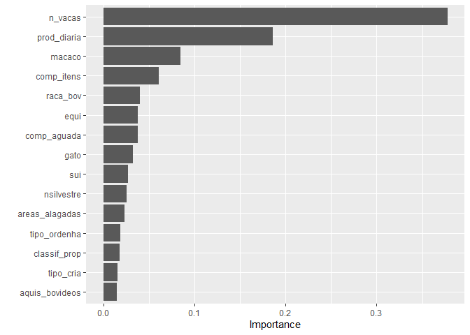

<!-- README.md is generated from README.Rmd. Please edit that file -->

# Tuberculo Bovina

### Carregando os pacotes

``` r
library(tidymodels)
library(ISLR)
library(tidyverse)
library(modeldata)
library(pROC)
library(vip)
library(readxl)
```

### Entrada de dados

``` r
tbsp <- read_excel("data-raw/TBSP_outubro.xls") |> 
  mutate(TB = forcats::as_factor(TB))
glimpse(tbsp)
#> Rows: 1,743
#> Columns: 40
#> $ id             <dbl> 1, 2, 3, 4, 5, 6, 7, 8, 9, 10, 11, 12, 13, 14, 15, 16, ~
#> $ cod_mun        <dbl> 3500105, 3500105, 3500105, 3500808, 3500808, 3501103, 3~
#> $ TB             <fct> 0, 0, 0, 0, 0, 0, 1, 0, 0, 0, 0, 0, 0, 0, 0, 0, 0, 0, 0~
#> $ reb_ma_19      <dbl> 1, 1, 0, 0, 0, 1, 0, 0, 0, 1, 1, 1, 0, 1, 1, 0, 1, 0, 1~
#> $ tipo_exp       <dbl> 1, 1, 2, 1, 1, 1, 1, 3, 3, 1, 1, 1, 1, 2, 2, 2, 1, 2, 2~
#> $ tipo_cria      <dbl> 1, 1, 1, 1, 1, 1, 1, 1, 1, 1, 1, 1, 1, 1, 1, 1, 1, 1, 1~
#> $ n_ordenha      <dbl> 1, 1, 2, 1, 1, 1, 1, 2, 2, 1, 1, 1, 1, 3, 2, 2, 1, 2, 2~
#> $ tipo_ordenha   <dbl> 1, 1, 4, 1, 1, 1, 1, 4, 4, 1, 1, 1, 1, 4, 4, 4, 1, 4, 4~
#> $ n_vacas        <dbl> 0, 0, 4, 0, 0, 0, 0, 4, 1, 0, 0, 0, 0, 20, 15, 6, 0, 5,~
#> $ prod_diaria    <dbl> 0, 0, 30, 0, 0, 0, 0, 5, 5, 0, 0, 0, 0, 150, 60, 40, 0,~
#> $ inseminacao    <dbl> 1, 1, 1, 1, 1, 1, 1, 1, 1, 1, 1, 1, 1, 1, 1, 1, 1, 1, 1~
#> $ raca_bov       <dbl> 1, 1, 5, 1, 4, 4, 4, 4, 4, 1, 4, 1, 1, 4, 4, 4, 4, 4, 4~
#> $ ovi_cap        <dbl> 0, 0, 0, 0, 0, 1, 0, 1, 0, 0, 0, 0, 0, 0, 0, 0, 0, 0, 0~
#> $ equi           <dbl> 1, 1, 0, 1, 1, 1, 1, 1, 1, 1, 1, 0, 1, 1, 1, 0, 0, 1, 1~
#> $ sui            <dbl> 0, 0, 1, 0, 0, 0, 0, 1, 0, 1, 0, 0, 1, 0, 1, 1, 0, 0, 0~
#> $ aves           <dbl> 0, 0, 0, 1, 0, 1, 0, 1, 1, 1, 1, 0, 1, 1, 1, 1, 0, 1, 1~
#> $ cao            <dbl> 1, 1, 0, 1, 0, 1, 0, 1, 0, 1, 1, 0, 1, 1, 1, 0, 0, 1, 1~
#> $ gato           <dbl> 0, 0, 0, 0, 1, 1, 0, 1, 0, 1, 0, 0, 0, 1, 1, 0, 0, 1, 0~
#> $ nsilvestre     <dbl> 0, 0, 0, 0, 1, 0, 1, 1, 0, 0, 1, 1, 0, 0, 0, 0, 1, 0, 0~
#> $ cervideo       <dbl> 0, 0, 0, 0, 0, 0, 0, 0, 0, 0, 0, 0, 0, 0, 0, 0, 0, 0, 0~
#> $ capivara       <dbl> 0, 0, 0, 0, 0, 0, 1, 1, 0, 0, 0, 1, 0, 0, 0, 0, 0, 0, 0~
#> $ felideos       <dbl> 0, 0, 0, 0, 0, 0, 0, 0, 0, 0, 0, 0, 0, 0, 0, 0, 1, 0, 0~
#> $ marsu          <dbl> 0, 0, 0, 0, 0, 0, 0, 1, 0, 0, 1, 0, 0, 0, 0, 0, 1, 0, 0~
#> $ macaco         <dbl> 0, 0, 0, 0, 0, 0, 0, 0, 0, 0, 0, 0, 0, 0, 0, 0, 1, 0, 0~
#> $ outra_silv     <dbl> 0, 0, 0, 0, 1, 0, 1, 1, 0, 0, 0, 0, 0, 0, 0, 0, 0, 0, 0~
#> $ testa_tb       <dbl> 0, 0, 0, 0, 0, 0, 1, 0, 0, 0, 0, 0, 1, 0, 0, 0, 0, 0, 0~
#> $ regul_test_tb  <dbl> 0, 0, 0, 0, 0, 0, 4, 0, 0, 0, 0, 0, 4, 0, 0, 0, 0, 0, 0~
#> $ aquis_bovideos <dbl> 1, 0, 0, 1, 0, 1, 0, 0, 1, 0, 1, 0, 0, 1, 0, 0, 1, 0, 1~
#> $ aluga_pasto    <dbl> 0, 0, 0, 1, 0, 1, 0, 0, 1, 0, 1, 0, 1, 1, 0, 0, 0, 0, 0~
#> $ pasto_comum    <dbl> 0, 0, 0, 1, 0, 0, 0, 0, 0, 0, 0, 1, 0, 0, 0, 0, 0, 0, 0~
#> $ comp_itens     <dbl> 0, 0, 0, 0, 0, 0, 1, 0, 0, 0, 1, 1, 0, 1, 0, 0, 0, 0, 1~
#> $ areas_alagadas <dbl> 0, 0, 0, 0, 0, 0, 1, 1, 0, 0, 1, 0, 0, 0, 0, 1, 0, 0, 0~
#> $ gado_conc      <dbl> 0, 0, 0, 0, 0, 0, 0, 0, 0, 0, 0, 0, 1, 0, 0, 0, 0, 0, 0~
#> $ piquete_parto  <dbl> 0, 0, 0, 1, 0, 0, 0, 0, 0, 0, 0, 1, 0, 0, 0, 0, 0, 0, 0~
#> $ entr_leite     <dbl> 0, 0, 1, 0, 0, 0, 0, 0, 0, 0, 0, 0, 0, 1, 1, 0, 0, 1, 0~
#> $ lact_venda     <dbl> 0, 0, 0, 0, 0, 0, 0, 0, 0, 0, 0, 0, 0, 0, 0, 1, 0, 0, 0~
#> $ assis_vet      <dbl> 0, 0, 0, 1, 1, 0, 0, 1, 0, 1, 1, 1, 1, 0, 0, 0, 0, 1, 0~
#> $ alim_soro      <dbl> 0, 0, 0, 0, 0, 0, 0, 0, 0, 0, 0, 0, 0, 0, 0, 0, 0, 0, 0~
#> $ comp_aguada    <dbl> 0, 1, 1, 0, 0, 0, 0, 1, 1, 1, 1, 1, 0, 0, 0, 0, 0, 0, 0~
#> $ classif_prop   <dbl> 1, 1, 1, 1, 1, 1, 1, 1, 4, 1, 1, 1, 1, 3, 1, 1, 1, 3, 1~
tbsp |> count(TB)
#> # A tibble: 2 x 2
#>   TB        n
#>   <fct> <int>
#> 1 0      1570
#> 2 1       173
```

### Definindo a base de treino e a base de teste

``` r
set.seed(1)
tbsp_initial_split <- initial_split(tbsp, strata = "TB", prop = 0.75)

tbsp_train <- training(tbsp_initial_split)
tbsp_train |> count(TB)
#> # A tibble: 2 x 2
#>   TB        n
#>   <fct> <int>
#> 1 0      1179
#> 2 1       128
tbsp_test  <- testing(tbsp_initial_split)
tbsp_test |> count(TB)
#> # A tibble: 2 x 2
#>   TB        n
#>   <fct> <int>
#> 1 0       391
#> 2 1        45
```

### Análise exploratória dos dados

``` r
skimr::skim(tbsp_train)
```

|                                                  |             |
|:-------------------------------------------------|:------------|
| Name                                             | tbsp\_train |
| Number of rows                                   | 1307        |
| Number of columns                                | 40          |
| \_\_\_\_\_\_\_\_\_\_\_\_\_\_\_\_\_\_\_\_\_\_\_   |             |
| Column type frequency:                           |             |
| factor                                           | 1           |
| numeric                                          | 39          |
| \_\_\_\_\_\_\_\_\_\_\_\_\_\_\_\_\_\_\_\_\_\_\_\_ |             |
| Group variables                                  | None        |

Data summary

**Variable type: factor**

| skim\_variable | n\_missing | complete\_rate | ordered | n\_unique | top\_counts     |
|:---------------|-----------:|---------------:|:--------|----------:|:----------------|
| TB             |          0 |              1 | FALSE   |         2 | 0: 1179, 1: 128 |

**Variable type: numeric**

| skim\_variable  | n\_missing | complete\_rate |       mean |       sd |      p0 |       p25 |     p50 |     p75 |    p100 | hist  |
|:----------------|-----------:|---------------:|-----------:|---------:|--------:|----------:|--------:|--------:|--------:|:------|
| id              |          0 |              1 |     869.38 |   504.18 |       1 |     435.5 |     863 |    1307 |    1743 | ▇▇▇▇▇ |
| cod\_mun        |          0 |              1 | 3528956.22 | 16329.82 | 3500105 | 3514858.5 | 3529302 | 3542701 | 3557204 | ▇▇▇▇▇ |
| reb\_ma\_19     |          0 |              1 |       0.29 |     0.45 |       0 |       0.0 |       0 |       1 |       1 | ▇▁▁▁▃ |
| tipo\_exp       |          0 |              1 |       1.91 |     0.79 |       1 |       1.0 |       2 |       3 |       3 | ▇▁▇▁▆ |
| tipo\_cria      |          0 |              1 |       1.15 |     0.38 |       1 |       1.0 |       1 |       1 |       3 | ▇▁▁▁▁ |
| n\_ordenha      |          0 |              1 |       1.68 |     0.61 |       1 |       1.0 |       2 |       2 |       3 | ▆▁▇▁▁ |
| tipo\_ordenha   |          0 |              1 |       2.73 |     1.43 |       1 |       1.0 |       4 |       4 |       4 | ▆▁▁▁▇ |
| n\_vacas        |          0 |              1 |       4.96 |    10.17 |       0 |       0.0 |       1 |       5 |     160 | ▇▁▁▁▁ |
| prod\_diaria    |          0 |              1 |      35.43 |   101.86 |       0 |       0.0 |       5 |      25 |    1600 | ▇▁▁▁▁ |
| inseminacao     |          0 |              1 |       1.09 |     0.35 |       1 |       1.0 |       1 |       1 |       3 | ▇▁▁▁▁ |
| raca\_bov       |          0 |              1 |       3.21 |     1.36 |       0 |       2.0 |       4 |       4 |       5 | ▃▁▁▇▁ |
| ovi\_cap        |          0 |              1 |       0.15 |     0.35 |       0 |       0.0 |       0 |       0 |       1 | ▇▁▁▁▂ |
| equi            |          0 |              1 |       0.71 |     0.45 |       0 |       0.0 |       1 |       1 |       1 | ▃▁▁▁▇ |
| sui             |          0 |              1 |       0.33 |     0.47 |       0 |       0.0 |       0 |       1 |       1 | ▇▁▁▁▃ |
| aves            |          0 |              1 |       0.68 |     0.47 |       0 |       0.0 |       1 |       1 |       1 | ▃▁▁▁▇ |
| cao             |          0 |              1 |       0.79 |     0.40 |       0 |       1.0 |       1 |       1 |       1 | ▂▁▁▁▇ |
| gato            |          0 |              1 |       0.41 |     0.49 |       0 |       0.0 |       0 |       1 |       1 | ▇▁▁▁▆ |
| nsilvestre      |          0 |              1 |       0.60 |     0.49 |       0 |       0.0 |       1 |       1 |       1 | ▆▁▁▁▇ |
| cervideo        |          0 |              1 |       0.11 |     0.31 |       0 |       0.0 |       0 |       0 |       1 | ▇▁▁▁▁ |
| capivara        |          0 |              1 |       0.24 |     0.42 |       0 |       0.0 |       0 |       0 |       1 | ▇▁▁▁▂ |
| felideos        |          0 |              1 |       0.12 |     0.33 |       0 |       0.0 |       0 |       0 |       1 | ▇▁▁▁▁ |
| marsu           |          0 |              1 |       0.41 |     0.49 |       0 |       0.0 |       0 |       1 |       1 | ▇▁▁▁▆ |
| macaco          |          0 |              1 |       0.24 |     0.42 |       0 |       0.0 |       0 |       0 |       1 | ▇▁▁▁▂ |
| outra\_silv     |          0 |              1 |       0.14 |     0.35 |       0 |       0.0 |       0 |       0 |       1 | ▇▁▁▁▂ |
| testa\_tb       |          0 |              1 |       0.13 |     0.34 |       0 |       0.0 |       0 |       0 |       1 | ▇▁▁▁▁ |
| regul\_test\_tb |          0 |              1 |       0.31 |     0.92 |       0 |       0.0 |       0 |       0 |       4 | ▇▁▁▁▁ |
| aquis\_bovideos |          0 |              1 |       0.42 |     0.49 |       0 |       0.0 |       0 |       1 |       1 | ▇▁▁▁▆ |
| aluga\_pasto    |          0 |              1 |       0.17 |     0.38 |       0 |       0.0 |       0 |       0 |       1 | ▇▁▁▁▂ |
| pasto\_comum    |          0 |              1 |       0.15 |     0.35 |       0 |       0.0 |       0 |       0 |       1 | ▇▁▁▁▂ |
| comp\_itens     |          0 |              1 |       0.16 |     0.37 |       0 |       0.0 |       0 |       0 |       1 | ▇▁▁▁▂ |
| areas\_alagadas |          0 |              1 |       0.31 |     0.46 |       0 |       0.0 |       0 |       1 |       1 | ▇▁▁▁▃ |
| gado\_conc      |          0 |              1 |       0.08 |     0.27 |       0 |       0.0 |       0 |       0 |       1 | ▇▁▁▁▁ |
| piquete\_parto  |          0 |              1 |       0.20 |     0.40 |       0 |       0.0 |       0 |       0 |       1 | ▇▁▁▁▂ |
| entr\_leite     |          0 |              1 |       0.25 |     0.44 |       0 |       0.0 |       0 |       1 |       1 | ▇▁▁▁▃ |
| lact\_venda     |          0 |              1 |       0.03 |     0.17 |       0 |       0.0 |       0 |       0 |       1 | ▇▁▁▁▁ |
| assis\_vet      |          0 |              1 |       0.33 |     0.47 |       0 |       0.0 |       0 |       1 |       1 | ▇▁▁▁▃ |
| alim\_soro      |          0 |              1 |       0.01 |     0.08 |       0 |       0.0 |       0 |       0 |       1 | ▇▁▁▁▁ |
| comp\_aguada    |          0 |              1 |       0.17 |     0.37 |       0 |       0.0 |       0 |       0 |       1 | ▇▁▁▁▂ |
| classif\_prop   |          0 |              1 |       1.30 |     0.84 |       1 |       1.0 |       1 |       1 |       4 | ▇▁▁▁▁ |

``` r
visdat::vis_miss(tbsp_train)
```

<!-- -->

``` r
tbsp_train  |> 
   select(where(is.numeric))  |> 
   cor()  |> 
   corrplot::corrplot()
```

<!-- -->

# Regressão Logística (não é Machine Learning…)

## Data Prep

``` r
tbsp_recipe <- recipe(TB ~ ., data = tbsp_train |> 
                        select(-id, -cod_mun)
                      ) |> 
  step_normalize(all_numeric_predictors())  |> 
  step_novel(all_nominal_predictors()) |> 
  step_zv(all_predictors()) |> 
  # step_poly(c(n_vacas, prod_diaria), degree = 9)  |> 
  step_dummy(all_nominal_predictors())

bake(prep(tbsp_recipe), new_data = NULL)
#> # A tibble: 1,307 x 38
#>    reb_ma_19 tipo_exp tipo_cria n_ordenha tipo_ordenha n_vacas prod_diaria
#>        <dbl>    <dbl>     <dbl>     <dbl>        <dbl>   <dbl>       <dbl>
#>  1     1.56    -1.15     -0.387    -1.12        -1.20  -0.487      -0.348 
#>  2    -0.639   -1.15     -0.387    -1.12        -1.20  -0.487      -0.348 
#>  3    -0.639   -1.15     -0.387    -1.12        -1.20  -0.487      -0.348 
#>  4    -0.639   -1.15     -0.387    -1.12        -1.20  -0.487      -0.348 
#>  5    -0.639    1.37     -0.387     0.533        0.888 -0.0940     -0.299 
#>  6    -0.639    1.37     -0.387     0.533        0.888 -0.389      -0.299 
#>  7    -0.639   -1.15     -0.387    -1.12        -1.20  -0.487      -0.348 
#>  8     1.56     0.109    -0.387     2.18         0.888  1.48        1.12  
#>  9     1.56     0.109    -0.387     0.533        0.888  0.988       0.241 
#> 10    -0.639    0.109    -0.387     0.533        0.888  0.103       0.0449
#> # ... with 1,297 more rows, and 31 more variables: inseminacao <dbl>,
#> #   raca_bov <dbl>, ovi_cap <dbl>, equi <dbl>, sui <dbl>, aves <dbl>,
#> #   cao <dbl>, gato <dbl>, nsilvestre <dbl>, cervideo <dbl>, capivara <dbl>,
#> #   felideos <dbl>, marsu <dbl>, macaco <dbl>, outra_silv <dbl>,
#> #   testa_tb <dbl>, regul_test_tb <dbl>, aquis_bovideos <dbl>,
#> #   aluga_pasto <dbl>, pasto_comum <dbl>, comp_itens <dbl>,
#> #   areas_alagadas <dbl>, gado_conc <dbl>, piquete_parto <dbl>, ...
visdat::vis_miss(bake(prep(tbsp_recipe), new_data = NULL))
```

<!-- -->

### Modelo

#### Definição de

1.  a f(x): logistc\_reg()

2.  modo (natureza da var resp): classification

3.  hiperparametros a tunar: penalty = tune()

4.  hiperparametros não tunado: mixture = 1 \# LASSO

5.  o motor que queremos usar: glmnet

``` r
tbsp_lr_model <- logistic_reg(penalty = tune(), mixture = 1)  |> 
  set_mode("classification") |> 
  set_engine("glmnet")
```

# Workflow

``` r
tbsp_lr_wf <- workflow()  |> 
  add_model(tbsp_lr_model) |> 
  add_recipe(tbsp_recipe)
```

## Tunagem (tune)

1.  bases de reamostragem para validação: vfold\_cv()

2.  (opcional) grade de parâmetros: parameters() %&gt;% update() %&gt;%
    grid\_regular()

3.  tune\_grid(y \~ x + …)

4.  escolha das métricas (rmse, roc\_auc, etc)

5.  collect\_metrics() ou autoplot() para ver o resultado

``` r
tbsp_resamples <- vfold_cv(tbsp_train, v = 5, strata = "TB")
grid <- grid_regular(
  penalty(range = c(-4, -2)),
  levels = 20
)
```

``` r
tbsp_lr_tune_grid <- tune_grid(
  tbsp_lr_wf,
  resamples = tbsp_resamples,
  grid = grid,
  metrics = metric_set(
    mn_log_loss, #binary cross entropy
    accuracy,
    roc_auc,
    # kap, # KAPPA
    # precision,
    # recall,
    # f_meas,
  )
)
#> Warning: package 'glmnet' was built under R version 4.1.2
# autoplot(tbsp_lr_tune_grid)
```

``` r
area_rl <- collect_metrics(tbsp_lr_tune_grid) |> 
  filter(.metric == "roc_auc") |> 
  summarise(area = mean(mean),
            desvio_pad = mean(std_err))

collect_metrics(tbsp_lr_tune_grid)  |> 
  ggplot(aes(x = penalty, y = mean)) +
  geom_point() +
  geom_ribbon(aes(ymin = mean - std_err, ymax = mean + std_err), alpha = 0.1) +
  facet_wrap(~.metric, ncol = 2, scales = "free_y") +
  scale_x_log10()
```

<!-- -->

# Desempenho do modelo final

1.  extrai melhor modelo com select\_best()

2.  finaliza o modelo inicial com finalize\_model()

3.  ajusta o modelo final com todos os dados de treino (a base de
    validação é incorporada)

``` r
tbsp_lr_best_params <- select_best(tbsp_lr_tune_grid, "roc_auc")
tbsp_lr_wf <- tbsp_lr_wf |> finalize_workflow(tbsp_lr_best_params)

tbsp_lr_last_fit <- last_fit(
  tbsp_lr_wf,
  tbsp_initial_split
)

# Variáveis importantes
tbsp_lr_last_fit_model <- tbsp_lr_last_fit$.workflow[[1]]$fit$fit
vip(tbsp_lr_last_fit_model)
```

<!-- -->

``` r
## 
tbsp_lr_last_fit$.metrics
#> [[1]]
#> # A tibble: 2 x 4
#>   .metric  .estimator .estimate .config             
#>   <chr>    <chr>          <dbl> <chr>               
#> 1 accuracy binary         0.899 Preprocessor1_Model1
#> 2 roc_auc  binary         0.714 Preprocessor1_Model1
```

# Guardar tudo

``` r
write_rds(tbsp_lr_last_fit, "data/tbsp_lr_last_fit.rds")
write_rds(tbsp_lr_model, "data/tbsp_lr_model.rds")
collect_metrics(tbsp_lr_last_fit)
#> # A tibble: 2 x 4
#>   .metric  .estimator .estimate .config             
#>   <chr>    <chr>          <dbl> <chr>               
#> 1 accuracy binary         0.899 Preprocessor1_Model1
#> 2 roc_auc  binary         0.714 Preprocessor1_Model1
tbsp_test_preds_lr <- collect_predictions(tbsp_lr_last_fit)
```

## roc

``` r
tbsp_roc_curve_lr <- tbsp_test_preds_lr  |>  roc_curve(TB, .pred_0)
autoplot(tbsp_roc_curve_lr)
```

<!-- -->

``` r
tbsp_lift_curve_lr <- tbsp_test_preds_lr  |>  lift_curve(TB, .pred_0)
autoplot(tbsp_lift_curve_lr)
```

<!-- -->

### Matriz de Confusão

``` r
tbsp_test_preds_lr <- tbsp_test_preds_lr |> 
  mutate(
    TB_class = factor(if_else(.pred_0 > 0.9, "0", "1"))
  ) 
tbsp_test_preds_lr |> conf_mat(TB, TB_class)
#>           Truth
#> Prediction   0   1
#>          0 288  18
#>          1 103  27
```

# Árvore de decisão

## Data prep

``` r
tbsp_dt_recipe <- recipe(TB ~ ., data = tbsp_train |> 
                        select(-id, -cod_mun))  |> 
  step_novel(all_nominal_predictors()) |> 
  step_zv(all_predictors())
```

## Modelo

``` r
tbsp_dt_model <- decision_tree(
  cost_complexity = tune(),
  tree_depth = tune(),
  min_n = tune()
)  |> 
  set_mode("classification")  |> 
  set_engine("rpart")
```

## Workflow

``` r
tbsp_dt_wf <- workflow()  |> 
  add_model(tbsp_dt_model) |> 
  add_recipe(tbsp_dt_recipe)
```

## Tune

``` r
grid_dt <- grid_random(
  cost_complexity(c(-9, -2)),
  tree_depth(range = c(5, 15)),
  min_n(range = c(20, 40)),
  size = 20
)
```

``` r
tbsp_dt_tune_grid <- tune_grid(
  tbsp_dt_wf,
  resamples = tbsp_resamples,
  grid = grid_dt,
  metrics = metric_set(roc_auc)
)
```

``` r
autoplot(tbsp_dt_tune_grid)
```

<!-- -->

``` r
collect_metrics(tbsp_dt_tune_grid)
#> # A tibble: 20 x 9
#>    cost_complexity tree_depth min_n .metric .estimator  mean     n std_err
#>              <dbl>      <int> <int> <chr>   <chr>      <dbl> <int>   <dbl>
#>  1   0.0000000394          14    34 roc_auc binary     0.608     5  0.0170
#>  2   0.00000000210         12    30 roc_auc binary     0.609     5  0.0170
#>  3   0.00414                8    31 roc_auc binary     0.562     5  0.0280
#>  4   0.00000000437         14    22 roc_auc binary     0.614     5  0.0357
#>  5   0.000591              10    37 roc_auc binary     0.587     5  0.0276
#>  6   0.000000182            5    26 roc_auc binary     0.639     5  0.0166
#>  7   0.00000000200         11    21 roc_auc binary     0.615     5  0.0359
#>  8   0.00000171             9    37 roc_auc binary     0.587     5  0.0276
#>  9   0.000000872           10    34 roc_auc binary     0.608     5  0.0170
#> 10   0.0000304              6    35 roc_auc binary     0.589     5  0.0262
#> 11   0.0000865              6    39 roc_auc binary     0.587     5  0.0276
#> 12   0.0000938             14    37 roc_auc binary     0.587     5  0.0276
#> 13   0.00000650            14    24 roc_auc binary     0.613     5  0.0355
#> 14   0.00000240            11    35 roc_auc binary     0.589     5  0.0262
#> 15   0.000868               9    37 roc_auc binary     0.587     5  0.0276
#> 16   0.000000671            8    24 roc_auc binary     0.613     5  0.0355
#> 17   0.000000936            6    22 roc_auc binary     0.614     5  0.0357
#> 18   0.00000000269          5    30 roc_auc binary     0.612     5  0.0184
#> 19   0.000000538            7    20 roc_auc binary     0.615     5  0.0359
#> 20   0.000253              13    32 roc_auc binary     0.608     5  0.0170
#> # ... with 1 more variable: .config <chr>
```

## Desempenho dos modelos finais

``` r
tbsp_lr_best_params <- select_best(tbsp_lr_tune_grid, "roc_auc")
tbsp_lr_wf <- tbsp_lr_wf  |>  finalize_workflow(tbsp_lr_best_params)
tbsp_lr_last_fit <- last_fit(tbsp_lr_wf, tbsp_initial_split)
```

``` r
tbsp_dt_best_params <- select_best(tbsp_dt_tune_grid, "roc_auc")
tbsp_dt_wf <- tbsp_dt_wf %>% finalize_workflow(tbsp_dt_best_params)
tbsp_dt_last_fit <- last_fit(tbsp_dt_wf, tbsp_initial_split)
```

``` r
tbsp_test_preds <- bind_rows(
  collect_predictions(tbsp_lr_last_fit) |>  mutate(modelo = "lr"),
  collect_predictions(tbsp_dt_last_fit) |>  mutate(modelo = "dt")
)
```

``` r
## roc
tbsp_test_preds  |> 
  group_by(modelo)  |> 
  roc_curve(TB, .pred_0)  |> 
  autoplot()
```

<!-- -->

``` r
## lift
tbsp_test_preds  |> 
  group_by(modelo)  |> 
  lift_curve(TB, .pred_0)  |> 
  autoplot()
```

<!-- -->

# Variáveis importantes Regressão Logística

``` r
tbspt_lr_last_fit_model <- tbsp_lr_last_fit$.workflow[[1]]$fit$fit
vip(tbsp_lr_last_fit_model)
```

<!-- -->

# Árvore de Decisão

``` r
tbsp_dt_last_fit_model <- tbsp_dt_last_fit$.workflow[[1]]$fit$fit
vip(tbsp_dt_last_fit_model)
```

<!-- -->

``` r
# Guardar tudo ------------------------------------------------------------

write_rds(tbsp_dt_last_fit, "tbsp_dt_last_fit.rds")
write_rds(tbsp_dt_model, "tbsp_dt_model.rds")
collect_metrics(tbsp_dt_last_fit)
#> # A tibble: 2 x 4
#>   .metric  .estimator .estimate .config             
#>   <chr>    <chr>          <dbl> <chr>               
#> 1 accuracy binary         0.885 Preprocessor1_Model1
#> 2 roc_auc  binary         0.696 Preprocessor1_Model1
collect_metrics(tbsp_lr_last_fit)
#> # A tibble: 2 x 4
#>   .metric  .estimator .estimate .config             
#>   <chr>    <chr>          <dbl> <chr>               
#> 1 accuracy binary         0.899 Preprocessor1_Model1
#> 2 roc_auc  binary         0.714 Preprocessor1_Model1

# Modelo final ------------------------------------------------------------

tbsp_final_dt_model <- tbsp_dt_wf  |>  fit(tbsp)
```

``` r
tbsp_test_preds_dt <- collect_predictions(tbsp_dt_last_fit)
```

## roc

``` r
tbsp_roc_curve_dt <- tbsp_test_preds_dt  |>  roc_curve(TB, .pred_0)
autoplot(tbsp_roc_curve_dt)
```

<!-- -->

``` r
tbsp_lift_curve_dt <- tbsp_test_preds_dt  |>  lift_curve(TB, .pred_0)
autoplot(tbsp_lift_curve_dt)
```

<!-- -->

### Matriz de Confusão

``` r
tbsp_test_preds_dt <- tbsp_test_preds_dt |> 
  mutate(
    TB_class = factor(if_else(.pred_0 > 0.9, "0", "1"))
  ) 
tbsp_test_preds_dt |> conf_mat(TB, TB_class)
#>           Truth
#> Prediction   0   1
#>          0 317  22
#>          1  74  23
```

# Random Forest

## Data prep

``` r
tbsp_rf_recipe <- recipe(TB ~ ., data = tbsp_train |> 
                        select(-id, -cod_mun))  |> 
  step_novel(all_nominal_predictors()) |> 
  step_zv(all_predictors())
```

## Modelo

``` r
tbsp_rf_model <- rand_forest(
  min_n = tune(),
  mtry = tune(),
  trees = tune()
)  |> 
  set_mode("classification")  |> 
  set_engine("randomForest")
```

## Workflow

``` r
tbsp_rf_wf <- workflow()  |> 
  add_model(tbsp_rf_model) |> 
  add_recipe(tbsp_rf_recipe)
```

## Tune

``` r
grid_rf <- grid_random(
  min_n(range = c(20, 40)),
  mtry(range = c(1,10)),
  trees(range = c(1,1000) ),
  size = 20
)
```

``` r
tbsp_rf_tune_grid <- tune_grid(
  tbsp_rf_wf,
  resamples = tbsp_resamples,
  grid = grid_rf,
  metrics = metric_set(roc_auc)
)
```

``` r
autoplot(tbsp_rf_tune_grid)
```

<!-- -->

``` r
collect_metrics(tbsp_rf_tune_grid)
#> # A tibble: 20 x 9
#>     mtry trees min_n .metric .estimator  mean     n std_err .config             
#>    <int> <int> <int> <chr>   <chr>      <dbl> <int>   <dbl> <chr>               
#>  1     6   864    26 roc_auc binary     0.683     5  0.0197 Preprocessor1_Model~
#>  2     6    74    24 roc_auc binary     0.669     5  0.0200 Preprocessor1_Model~
#>  3     8   273    34 roc_auc binary     0.684     5  0.0204 Preprocessor1_Model~
#>  4     7   514    35 roc_auc binary     0.678     5  0.0289 Preprocessor1_Model~
#>  5     7   389    35 roc_auc binary     0.672     5  0.0218 Preprocessor1_Model~
#>  6     1   703    40 roc_auc binary     0.644     5  0.0109 Preprocessor1_Model~
#>  7     9   676    32 roc_auc binary     0.689     5  0.0258 Preprocessor1_Model~
#>  8     2   709    28 roc_auc binary     0.672     5  0.0129 Preprocessor1_Model~
#>  9     1   390    26 roc_auc binary     0.628     5  0.0147 Preprocessor1_Model~
#> 10    10   325    31 roc_auc binary     0.673     5  0.0266 Preprocessor1_Model~
#> 11     8   383    37 roc_auc binary     0.668     5  0.0251 Preprocessor1_Model~
#> 12    10   680    35 roc_auc binary     0.686     5  0.0187 Preprocessor1_Model~
#> 13     8   146    36 roc_auc binary     0.666     5  0.0219 Preprocessor1_Model~
#> 14     9   819    30 roc_auc binary     0.680     5  0.0266 Preprocessor1_Model~
#> 15     4   740    23 roc_auc binary     0.668     5  0.0210 Preprocessor1_Model~
#> 16    10    15    34 roc_auc binary     0.627     5  0.0140 Preprocessor1_Model~
#> 17     4   528    22 roc_auc binary     0.688     5  0.0156 Preprocessor1_Model~
#> 18     2   663    33 roc_auc binary     0.669     5  0.0173 Preprocessor1_Model~
#> 19     3   685    33 roc_auc binary     0.672     5  0.0214 Preprocessor1_Model~
#> 20     1   701    21 roc_auc binary     0.677     5  0.0240 Preprocessor1_Model~
```

## Desempenho dos modelos finais

``` r
tbsp_rf_best_params <- select_best(tbsp_rf_tune_grid, "roc_auc")
tbsp_rf_wf <- tbsp_rf_wf  |>  finalize_workflow(tbsp_rf_best_params)
tbsp_rf_last_fit <- last_fit(tbsp_rf_wf, tbsp_initial_split)
```

``` r
tbsp_test_preds <- bind_rows(
  collect_predictions(tbsp_lr_last_fit) |>  mutate(modelo = "lr"),
  collect_predictions(tbsp_rf_last_fit) |>  mutate(modelo = "rf"),
  collect_predictions(tbsp_dt_last_fit) |>  mutate(modelo = "dt")
)
```

``` r
## roc
tbsp_test_preds  |> 
  group_by(modelo)  |> 
  roc_curve(TB, .pred_0)  |> 
  autoplot()
```

<!-- -->

``` r
## lift
tbsp_test_preds  |> 
  group_by(modelo)  |> 
  lift_curve(TB, .pred_0)  |> 
  autoplot()
```

<!-- -->

# Random Forest

``` r
tbsp_rf_last_fit_model <- tbsp_rf_last_fit$.workflow[[1]]$fit$fit
vip(tbsp_rf_last_fit_model)
```

<!-- -->

``` r
# Guardar tudo ------------------------------------------------------------

write_rds(tbsp_rf_last_fit, "tbsp_rf_last_fit.rds")
write_rds(tbsp_rf_model, "tbsp_rf_model.rds")
collect_metrics(tbsp_lr_last_fit)
#> # A tibble: 2 x 4
#>   .metric  .estimator .estimate .config             
#>   <chr>    <chr>          <dbl> <chr>               
#> 1 accuracy binary         0.899 Preprocessor1_Model1
#> 2 roc_auc  binary         0.714 Preprocessor1_Model1
collect_metrics(tbsp_dt_last_fit)
#> # A tibble: 2 x 4
#>   .metric  .estimator .estimate .config             
#>   <chr>    <chr>          <dbl> <chr>               
#> 1 accuracy binary         0.885 Preprocessor1_Model1
#> 2 roc_auc  binary         0.696 Preprocessor1_Model1
collect_metrics(tbsp_rf_last_fit)
#> # A tibble: 2 x 4
#>   .metric  .estimator .estimate .config             
#>   <chr>    <chr>          <dbl> <chr>               
#> 1 accuracy binary         0.897 Preprocessor1_Model1
#> 2 roc_auc  binary         0.702 Preprocessor1_Model1

# Modelo final ------------------------------------------------------------
tbsp_final_dt_model <- tbsp_rf_wf  |>  fit(tbsp)
```

``` r
tbsp_test_preds_rf <- collect_predictions(tbsp_rf_last_fit)
```

## roc

``` r
tbsp_roc_curve_rf <- tbsp_test_preds_rf  |>  roc_curve(TB, .pred_0)
autoplot(tbsp_roc_curve_rf)
```

<!-- -->

``` r
tbsp_lift_curve_rf <- tbsp_test_preds_rf  |>  lift_curve(TB, .pred_0)
autoplot(tbsp_lift_curve_rf)
```

<!-- -->

### Matriz de Confusão

``` r
tbsp_test_preds_rf <- tbsp_test_preds_rf |> 
  mutate(
    TB_class = factor(if_else(.pred_0 > 0.9, "0", "1"))
  ) 
tbsp_test_preds_rf |> conf_mat(TB, TB_class)
#>           Truth
#> Prediction   0   1
#>          0 370  35
#>          1  21  10
```

# Boosting gradient tree

## Data prep

``` r
tbsp_xgb_recipe <- recipe(TB ~ ., data = tbsp_train |> 
                        select(-id, -cod_mun))  |> 
  step_novel(all_nominal_predictors()) |> 
  step_zv(all_predictors())
```

## Estratégia de Tunagem de Hiperparâmetros

### Passo 1:

Achar uma combinação `learning_rate` e `trees` que funciona
relativamente bem.

-   `learn_rate` - 0.05, 0.1, 0.3
-   `trees` - 100, 500, 1000, 1500

## Modelo

``` r
cores = 4
tbsp_xgb_model <- boost_tree(
  mtry = 0.8, 
  trees = tune(), # <---------------
  min_n = 5, 
  tree_depth = 4,
  loss_reduction = 0, # lambda
  learn_rate = tune(), # epsilon
  sample_size = 0.8
) |>  
  set_mode("classification")  |> 
  set_engine("xgboost", nthread = cores, counts = FALSE)
```

## Workflow

``` r
tbsp_xgb_wf <- workflow()  |> 
  add_model(tbsp_xgb_model) |> 
  add_recipe(tbsp_xgb_recipe)
```

## Tune

``` r
grid_xgb <- expand.grid(
  learn_rate = c(0.05, 0.3, .8, 1.2),
  trees = c(2, 250, 500, 1000)
)
```

``` r
tbsp_xgb_tune_grid <- tune_grid(
  tbsp_xgb_wf,
  resamples = tbsp_resamples,
  grid = grid_xgb,
  metrics = metric_set(roc_auc)
)
#> [17:53:02] WARNING: amalgamation/../src/c_api/c_api.cc:718: `ntree_limit` is deprecated, use `iteration_range` instead.
#> [17:53:02] WARNING: amalgamation/../src/c_api/c_api.cc:718: `ntree_limit` is deprecated, use `iteration_range` instead.
#> [17:53:02] WARNING: amalgamation/../src/c_api/c_api.cc:718: `ntree_limit` is deprecated, use `iteration_range` instead.
#> [17:53:05] WARNING: amalgamation/../src/c_api/c_api.cc:718: `ntree_limit` is deprecated, use `iteration_range` instead.
#> [17:53:05] WARNING: amalgamation/../src/c_api/c_api.cc:718: `ntree_limit` is deprecated, use `iteration_range` instead.
#> [17:53:05] WARNING: amalgamation/../src/c_api/c_api.cc:718: `ntree_limit` is deprecated, use `iteration_range` instead.
#> [17:53:08] WARNING: amalgamation/../src/c_api/c_api.cc:718: `ntree_limit` is deprecated, use `iteration_range` instead.
#> [17:53:08] WARNING: amalgamation/../src/c_api/c_api.cc:718: `ntree_limit` is deprecated, use `iteration_range` instead.
#> [17:53:08] WARNING: amalgamation/../src/c_api/c_api.cc:718: `ntree_limit` is deprecated, use `iteration_range` instead.
#> [17:53:10] WARNING: amalgamation/../src/c_api/c_api.cc:718: `ntree_limit` is deprecated, use `iteration_range` instead.
#> [17:53:10] WARNING: amalgamation/../src/c_api/c_api.cc:718: `ntree_limit` is deprecated, use `iteration_range` instead.
#> [17:53:10] WARNING: amalgamation/../src/c_api/c_api.cc:718: `ntree_limit` is deprecated, use `iteration_range` instead.
#> [17:53:13] WARNING: amalgamation/../src/c_api/c_api.cc:718: `ntree_limit` is deprecated, use `iteration_range` instead.
#> [17:53:13] WARNING: amalgamation/../src/c_api/c_api.cc:718: `ntree_limit` is deprecated, use `iteration_range` instead.
#> [17:53:13] WARNING: amalgamation/../src/c_api/c_api.cc:718: `ntree_limit` is deprecated, use `iteration_range` instead.
#> [17:53:16] WARNING: amalgamation/../src/c_api/c_api.cc:718: `ntree_limit` is deprecated, use `iteration_range` instead.
#> [17:53:16] WARNING: amalgamation/../src/c_api/c_api.cc:718: `ntree_limit` is deprecated, use `iteration_range` instead.
#> [17:53:16] WARNING: amalgamation/../src/c_api/c_api.cc:718: `ntree_limit` is deprecated, use `iteration_range` instead.
#> [17:53:19] WARNING: amalgamation/../src/c_api/c_api.cc:718: `ntree_limit` is deprecated, use `iteration_range` instead.
#> [17:53:19] WARNING: amalgamation/../src/c_api/c_api.cc:718: `ntree_limit` is deprecated, use `iteration_range` instead.
#> [17:53:19] WARNING: amalgamation/../src/c_api/c_api.cc:718: `ntree_limit` is deprecated, use `iteration_range` instead.
#> [17:53:21] WARNING: amalgamation/../src/c_api/c_api.cc:718: `ntree_limit` is deprecated, use `iteration_range` instead.
#> [17:53:21] WARNING: amalgamation/../src/c_api/c_api.cc:718: `ntree_limit` is deprecated, use `iteration_range` instead.
#> [17:53:21] WARNING: amalgamation/../src/c_api/c_api.cc:718: `ntree_limit` is deprecated, use `iteration_range` instead.
#> [17:53:24] WARNING: amalgamation/../src/c_api/c_api.cc:718: `ntree_limit` is deprecated, use `iteration_range` instead.
#> [17:53:24] WARNING: amalgamation/../src/c_api/c_api.cc:718: `ntree_limit` is deprecated, use `iteration_range` instead.
#> [17:53:24] WARNING: amalgamation/../src/c_api/c_api.cc:718: `ntree_limit` is deprecated, use `iteration_range` instead.
#> [17:53:27] WARNING: amalgamation/../src/c_api/c_api.cc:718: `ntree_limit` is deprecated, use `iteration_range` instead.
#> [17:53:27] WARNING: amalgamation/../src/c_api/c_api.cc:718: `ntree_limit` is deprecated, use `iteration_range` instead.
#> [17:53:27] WARNING: amalgamation/../src/c_api/c_api.cc:718: `ntree_limit` is deprecated, use `iteration_range` instead.
#> [17:53:29] WARNING: amalgamation/../src/c_api/c_api.cc:718: `ntree_limit` is deprecated, use `iteration_range` instead.
#> [17:53:29] WARNING: amalgamation/../src/c_api/c_api.cc:718: `ntree_limit` is deprecated, use `iteration_range` instead.
#> [17:53:29] WARNING: amalgamation/../src/c_api/c_api.cc:718: `ntree_limit` is deprecated, use `iteration_range` instead.
#> [17:53:32] WARNING: amalgamation/../src/c_api/c_api.cc:718: `ntree_limit` is deprecated, use `iteration_range` instead.
#> [17:53:32] WARNING: amalgamation/../src/c_api/c_api.cc:718: `ntree_limit` is deprecated, use `iteration_range` instead.
#> [17:53:32] WARNING: amalgamation/../src/c_api/c_api.cc:718: `ntree_limit` is deprecated, use `iteration_range` instead.
#> [17:53:35] WARNING: amalgamation/../src/c_api/c_api.cc:718: `ntree_limit` is deprecated, use `iteration_range` instead.
#> [17:53:35] WARNING: amalgamation/../src/c_api/c_api.cc:718: `ntree_limit` is deprecated, use `iteration_range` instead.
#> [17:53:35] WARNING: amalgamation/../src/c_api/c_api.cc:718: `ntree_limit` is deprecated, use `iteration_range` instead.
#> [17:53:38] WARNING: amalgamation/../src/c_api/c_api.cc:718: `ntree_limit` is deprecated, use `iteration_range` instead.
#> [17:53:38] WARNING: amalgamation/../src/c_api/c_api.cc:718: `ntree_limit` is deprecated, use `iteration_range` instead.
#> [17:53:38] WARNING: amalgamation/../src/c_api/c_api.cc:718: `ntree_limit` is deprecated, use `iteration_range` instead.
#> [17:53:40] WARNING: amalgamation/../src/c_api/c_api.cc:718: `ntree_limit` is deprecated, use `iteration_range` instead.
#> [17:53:40] WARNING: amalgamation/../src/c_api/c_api.cc:718: `ntree_limit` is deprecated, use `iteration_range` instead.
#> [17:53:40] WARNING: amalgamation/../src/c_api/c_api.cc:718: `ntree_limit` is deprecated, use `iteration_range` instead.
#> [17:53:43] WARNING: amalgamation/../src/c_api/c_api.cc:718: `ntree_limit` is deprecated, use `iteration_range` instead.
#> [17:53:43] WARNING: amalgamation/../src/c_api/c_api.cc:718: `ntree_limit` is deprecated, use `iteration_range` instead.
#> [17:53:43] WARNING: amalgamation/../src/c_api/c_api.cc:718: `ntree_limit` is deprecated, use `iteration_range` instead.
#> [17:53:46] WARNING: amalgamation/../src/c_api/c_api.cc:718: `ntree_limit` is deprecated, use `iteration_range` instead.
#> [17:53:46] WARNING: amalgamation/../src/c_api/c_api.cc:718: `ntree_limit` is deprecated, use `iteration_range` instead.
#> [17:53:46] WARNING: amalgamation/../src/c_api/c_api.cc:718: `ntree_limit` is deprecated, use `iteration_range` instead.
#> [17:53:48] WARNING: amalgamation/../src/c_api/c_api.cc:718: `ntree_limit` is deprecated, use `iteration_range` instead.
#> [17:53:48] WARNING: amalgamation/../src/c_api/c_api.cc:718: `ntree_limit` is deprecated, use `iteration_range` instead.
#> [17:53:48] WARNING: amalgamation/../src/c_api/c_api.cc:718: `ntree_limit` is deprecated, use `iteration_range` instead.
#> [17:53:51] WARNING: amalgamation/../src/c_api/c_api.cc:718: `ntree_limit` is deprecated, use `iteration_range` instead.
#> [17:53:51] WARNING: amalgamation/../src/c_api/c_api.cc:718: `ntree_limit` is deprecated, use `iteration_range` instead.
#> [17:53:51] WARNING: amalgamation/../src/c_api/c_api.cc:718: `ntree_limit` is deprecated, use `iteration_range` instead.
#> [17:53:53] WARNING: amalgamation/../src/c_api/c_api.cc:718: `ntree_limit` is deprecated, use `iteration_range` instead.
#> [17:53:53] WARNING: amalgamation/../src/c_api/c_api.cc:718: `ntree_limit` is deprecated, use `iteration_range` instead.
#> [17:53:53] WARNING: amalgamation/../src/c_api/c_api.cc:718: `ntree_limit` is deprecated, use `iteration_range` instead.
```

#### Melhores hiperparâmetros

``` r
autoplot(tbsp_xgb_tune_grid)
```

<!-- -->

``` r
tbsp_xgb_tune_grid  |>  show_best(metric = "roc_auc", n = 6)
#> # A tibble: 6 x 8
#>   trees learn_rate .metric .estimator  mean     n std_err .config              
#>   <dbl>      <dbl> <chr>   <chr>      <dbl> <int>   <dbl> <chr>                
#> 1   250       0.05 roc_auc binary     0.688     5 0.0320  Preprocessor1_Model02
#> 2   500       0.05 roc_auc binary     0.673     5 0.0353  Preprocessor1_Model03
#> 3     2       0.05 roc_auc binary     0.670     5 0.00957 Preprocessor1_Model01
#> 4     2       0.3  roc_auc binary     0.661     5 0.0140  Preprocessor1_Model05
#> 5  1000       0.05 roc_auc binary     0.657     5 0.0341  Preprocessor1_Model04
#> 6     2       0.8  roc_auc binary     0.649     5 0.0292  Preprocessor1_Model09
tbsp_xgb_select_best_passo1 <- tbsp_xgb_tune_grid %>% 
  select_best(metric = "roc_auc")
tbsp_xgb_select_best_passo1
#> # A tibble: 1 x 3
#>   trees learn_rate .config              
#>   <dbl>      <dbl> <chr>                
#> 1   250       0.05 Preprocessor1_Model02
```

### Passo 2:

São bons valores inciais. Agora, podemos tunar os parâmetros
relacionados à árvore.

-   `tree_depth`: vamos deixar ele variar entre 3 e 10.
-   `min_n`: vamos deixar variar entre 5 e 90.

``` r
tbsp_xgb_model <- boost_tree(
  mtry = 0.8,
  trees = tbsp_xgb_select_best_passo1$trees,
  min_n = tune(),
  tree_depth = tune(), 
  loss_reduction = 0, 
  learn_rate = tbsp_xgb_select_best_passo1$learn_rate, 
  sample_size = 0.8
) %>% 
  set_mode("classification")  |> 
  set_engine("xgboost", nthread = cores, counts = FALSE)

#### Workflow
tbsp_xgb_wf <- workflow() |>  
    add_model(tbsp_xgb_model)  |>  
    add_recipe(tbsp_xgb_recipe)

#### Grid
tbsp_xgb_grid <- expand.grid(
  tree_depth = c(1, 3, 4, 6, 10), 
  min_n = c(5, 30, 60, 90, 100, 200)
)

tbsp_xgb_tune_grid <- tbsp_xgb_wf  |>  
  tune_grid(
    resamples = tbsp_resamples,
    grid = tbsp_xgb_grid,
    control = control_grid(save_pred = TRUE, verbose = FALSE, allow_par = TRUE),
    metrics = metric_set(roc_auc)
  )

#### Melhores hiperparâmetros
autoplot(tbsp_xgb_tune_grid)
```

<!-- -->

``` r
tbsp_xgb_tune_grid  |>  show_best(metric = "roc_auc", n = 5)
#> # A tibble: 5 x 8
#>   min_n tree_depth .metric .estimator  mean     n std_err .config              
#>   <dbl>      <dbl> <chr>   <chr>      <dbl> <int>   <dbl> <chr>                
#> 1     5          4 roc_auc binary     0.691     5  0.0337 Preprocessor1_Model03
#> 2     5          3 roc_auc binary     0.690     5  0.0295 Preprocessor1_Model02
#> 3     5          6 roc_auc binary     0.684     5  0.0335 Preprocessor1_Model04
#> 4     5          1 roc_auc binary     0.684     5  0.0139 Preprocessor1_Model01
#> 5     5         10 roc_auc binary     0.684     5  0.0328 Preprocessor1_Model05
tbsp_xgb_select_best_passo2 <- tbsp_xgb_tune_grid |>  select_best(metric = "roc_auc")
tbsp_xgb_select_best_passo2
#> # A tibble: 1 x 3
#>   min_n tree_depth .config              
#>   <dbl>      <dbl> <chr>                
#> 1     5          4 Preprocessor1_Model03
```

### Passo 3:

Agora temos definidos:

-   `trees` = 250
-   `learn_rate` = 0.05
-   `min_n` = 5
-   `tree_depth` = 4

Vamos então tunar o `loss_reduction`:

`loss_reduction`: vamos deixar ele variar entre 0 e 2

``` r
tbsp_xgb_model <- boost_tree(
  mtry = 0.8,
  trees = tbsp_xgb_select_best_passo1$trees,
  min_n = tbsp_xgb_select_best_passo2$min_n,
  tree_depth = tbsp_xgb_select_best_passo2$tree_depth, 
  loss_reduction = tune(), 
  learn_rate = tbsp_xgb_select_best_passo1$learn_rate, 
  sample_size = 0.8
) |> 
  set_mode("classification") |> 
  set_engine("xgboost", nthread = cores, counts = FALSE)

#### Workflow
tbsp_xgb_wf <- workflow() |>  
    add_model(tbsp_xgb_model)  |>  
    add_recipe(tbsp_xgb_recipe)

#### Grid
tbsp_xgb_grid <- expand.grid(
  loss_reduction = c(0, 0.05, 1, 2, 4)
)

tbsp_xgb_tune_grid <- tbsp_xgb_wf  |>  
  tune_grid(
    resamples = tbsp_resamples,
    grid = tbsp_xgb_grid,
    control = control_grid(save_pred = TRUE, verbose = FALSE, allow_par = TRUE),
    metrics = metric_set(roc_auc)
  )

#### Melhores hiperparâmetros
autoplot(tbsp_xgb_tune_grid)
#> Warning: Transformation introduced infinite values in continuous x-axis

#> Warning: Transformation introduced infinite values in continuous x-axis
```

<!-- -->

``` r
tbsp_xgb_tune_grid  |>  show_best(metric = "roc_auc", n = 5)
#> # A tibble: 5 x 7
#>   loss_reduction .metric .estimator  mean     n std_err .config             
#>            <dbl> <chr>   <chr>      <dbl> <int>   <dbl> <chr>               
#> 1           4    roc_auc binary     0.701     5  0.0243 Preprocessor1_Model5
#> 2           2    roc_auc binary     0.695     5  0.0292 Preprocessor1_Model4
#> 3           0.05 roc_auc binary     0.686     5  0.0348 Preprocessor1_Model2
#> 4           1    roc_auc binary     0.686     5  0.0316 Preprocessor1_Model3
#> 5           0    roc_auc binary     0.685     5  0.0368 Preprocessor1_Model1
tbsp_xgb_select_best_passo3 <- tbsp_xgb_tune_grid %>% select_best(metric = "roc_auc")
tbsp_xgb_select_best_passo3
#> # A tibble: 1 x 2
#>   loss_reduction .config             
#>            <dbl> <chr>               
#> 1              4 Preprocessor1_Model5
```

### Passo 4:

Não parece que o `lossreduction` teve tanto efeito, mas, vamos usar 4
que deu o melhor resultado. Até agora temos definido:

-   `trees` = 250
-   `learn_rate` = 0.05
-   `min_n` = 5
-   `tree_depth` = 4
-   `lossreduction` = 4

Vamos então tunar o `mtry` e o `sample_size`:

-   `mtry`: de 10% a 100%
-   `sample_size`: de 50% a 100%

``` r
tbsp_xgb_model <- boost_tree(
  mtry = tune(),
  trees = tbsp_xgb_select_best_passo1$trees,
  min_n = tbsp_xgb_select_best_passo2$min_n,
  tree_depth = tbsp_xgb_select_best_passo2$tree_depth, 
  loss_reduction = tbsp_xgb_select_best_passo3$loss_reduction, 
  learn_rate = tbsp_xgb_select_best_passo1$learn_rate, 
  sample_size = tune()
) |>  
  set_mode("classification")  |> 
  set_engine("xgboost", nthread = cores, counts = FALSE)

#### Workflow
tbsp_xgb_wf <- workflow() |>  
    add_model(tbsp_xgb_model) |>  
    add_recipe(tbsp_xgb_recipe)

#### Grid
tbsp_xgb_grid <- expand.grid(
    sample_size = seq(0.5, 1.0, length.out = 2),
    mtry = seq(0.1, 1.0, length.out = 2)
)

tbsp_xgb_tune_grid <- tbsp_xgb_wf  |>  
  tune_grid(
    resamples = tbsp_resamples,
    grid = tbsp_xgb_grid,
    control = control_grid(save_pred = TRUE, verbose = FALSE, allow_par = TRUE),
    metrics = metric_set(roc_auc)
  )

#### Melhores hiperparâmetros
autoplot(tbsp_xgb_tune_grid)
```

<!-- -->

``` r
tbsp_xgb_tune_grid  |>  show_best(metric = "roc_auc", n = 5)
#> # A tibble: 4 x 8
#>    mtry sample_size .metric .estimator  mean     n std_err .config             
#>   <dbl>       <dbl> <chr>   <chr>      <dbl> <int>   <dbl> <chr>               
#> 1   1           1   roc_auc binary     0.704     5  0.0168 Preprocessor1_Model4
#> 2   0.1         1   roc_auc binary     0.694     5  0.0200 Preprocessor1_Model2
#> 3   0.1         0.5 roc_auc binary     0.686     5  0.0184 Preprocessor1_Model1
#> 4   1           0.5 roc_auc binary     0.679     5  0.0325 Preprocessor1_Model3
tbsp_xgb_select_best_passo4 <- tbsp_xgb_tune_grid  |>  select_best(metric = "roc_auc")
tbsp_xgb_select_best_passo4
#> # A tibble: 1 x 3
#>    mtry sample_size .config             
#>   <dbl>       <dbl> <chr>               
#> 1     1           1 Preprocessor1_Model4
```

### Passo 5:

Vimos que a melhor combinação foi

-   `mtry` = 1
-   `sample_size` = 1

Agora vamos tunar o `learn_rate` e o `trees` de novo, mas deixando o
`learn_rate` assumir valores menores.

``` r
tbsp_xgb_model <- boost_tree(
  mtry = tbsp_xgb_select_best_passo4$mtry,
  trees = tune(),
  min_n = tbsp_xgb_select_best_passo2$min_n,
  tree_depth = tbsp_xgb_select_best_passo2$tree_depth, 
  loss_reduction = tbsp_xgb_select_best_passo3$loss_reduction, 
  learn_rate = tune(), 
  sample_size = tbsp_xgb_select_best_passo4$sample_size
) |> 
  set_mode("classification") |> 
  set_engine("xgboost", nthread = cores, counts = FALSE)

#### Workflow
tbsp_xgb_wf <- workflow() |>  
    add_model(tbsp_xgb_model) |>  
    add_recipe(tbsp_xgb_recipe)

#### Grid
tbsp_xgb_grid <- expand.grid(
    learn_rate = c(0.05, 0.10, 0.15, 0.25),
    trees = c(100, 250)
)

tbsp_xgb_tune_grid <- tbsp_xgb_wf  |>  
  tune_grid(
    resamples = tbsp_resamples,
    grid = tbsp_xgb_grid,
    control = control_grid(save_pred = TRUE, verbose = FALSE, allow_par = TRUE),
    metrics = metric_set(roc_auc)
  )
#> [17:56:47] WARNING: amalgamation/../src/c_api/c_api.cc:718: `ntree_limit` is deprecated, use `iteration_range` instead.
#> [17:56:49] WARNING: amalgamation/../src/c_api/c_api.cc:718: `ntree_limit` is deprecated, use `iteration_range` instead.
#> [17:56:51] WARNING: amalgamation/../src/c_api/c_api.cc:718: `ntree_limit` is deprecated, use `iteration_range` instead.
#> [17:56:53] WARNING: amalgamation/../src/c_api/c_api.cc:718: `ntree_limit` is deprecated, use `iteration_range` instead.
#> [17:56:54] WARNING: amalgamation/../src/c_api/c_api.cc:718: `ntree_limit` is deprecated, use `iteration_range` instead.
#> [17:56:56] WARNING: amalgamation/../src/c_api/c_api.cc:718: `ntree_limit` is deprecated, use `iteration_range` instead.
#> [17:56:58] WARNING: amalgamation/../src/c_api/c_api.cc:718: `ntree_limit` is deprecated, use `iteration_range` instead.
#> [17:56:59] WARNING: amalgamation/../src/c_api/c_api.cc:718: `ntree_limit` is deprecated, use `iteration_range` instead.
#> [17:57:01] WARNING: amalgamation/../src/c_api/c_api.cc:718: `ntree_limit` is deprecated, use `iteration_range` instead.
#> [17:57:03] WARNING: amalgamation/../src/c_api/c_api.cc:718: `ntree_limit` is deprecated, use `iteration_range` instead.
#> [17:57:04] WARNING: amalgamation/../src/c_api/c_api.cc:718: `ntree_limit` is deprecated, use `iteration_range` instead.
#> [17:57:06] WARNING: amalgamation/../src/c_api/c_api.cc:718: `ntree_limit` is deprecated, use `iteration_range` instead.
#> [17:57:08] WARNING: amalgamation/../src/c_api/c_api.cc:718: `ntree_limit` is deprecated, use `iteration_range` instead.
#> [17:57:09] WARNING: amalgamation/../src/c_api/c_api.cc:718: `ntree_limit` is deprecated, use `iteration_range` instead.
#> [17:57:10] WARNING: amalgamation/../src/c_api/c_api.cc:718: `ntree_limit` is deprecated, use `iteration_range` instead.
#> [17:57:11] WARNING: amalgamation/../src/c_api/c_api.cc:718: `ntree_limit` is deprecated, use `iteration_range` instead.
#> [17:57:13] WARNING: amalgamation/../src/c_api/c_api.cc:718: `ntree_limit` is deprecated, use `iteration_range` instead.
#> [17:57:14] WARNING: amalgamation/../src/c_api/c_api.cc:718: `ntree_limit` is deprecated, use `iteration_range` instead.
#> [17:57:15] WARNING: amalgamation/../src/c_api/c_api.cc:718: `ntree_limit` is deprecated, use `iteration_range` instead.
#> [17:57:17] WARNING: amalgamation/../src/c_api/c_api.cc:718: `ntree_limit` is deprecated, use `iteration_range` instead.

#### Melhores hiperparâmetros
autoplot(tbsp_xgb_tune_grid)
```

<!-- -->

``` r
tbsp_xgb_tune_grid |>  show_best(metric = "roc_auc", n = 5)
#> # A tibble: 5 x 8
#>   trees learn_rate .metric .estimator  mean     n std_err .config             
#>   <dbl>      <dbl> <chr>   <chr>      <dbl> <int>   <dbl> <chr>               
#> 1   100       0.25 roc_auc binary     0.707     5  0.0165 Preprocessor1_Model7
#> 2   250       0.25 roc_auc binary     0.707     5  0.0165 Preprocessor1_Model8
#> 3   250       0.05 roc_auc binary     0.704     5  0.0168 Preprocessor1_Model2
#> 4   100       0.05 roc_auc binary     0.704     5  0.0168 Preprocessor1_Model1
#> 5   100       0.1  roc_auc binary     0.702     5  0.0158 Preprocessor1_Model3
tbsp_xgb_select_best_passo5 <- tbsp_xgb_tune_grid  |>  select_best(metric = "roc_auc")
tbsp_xgb_select_best_passo5
#> # A tibble: 1 x 3
#>   trees learn_rate .config             
#>   <dbl>      <dbl> <chr>               
#> 1   100       0.25 Preprocessor1_Model7
```

## Desempenho dos modelos finais

``` r
tbsp_xgb_model <- boost_tree(
  mtry = tbsp_xgb_select_best_passo4$mtry,
  trees = tbsp_xgb_select_best_passo5$trees,
  min_n = tbsp_xgb_select_best_passo2$min_n,
  tree_depth = tbsp_xgb_select_best_passo2$tree_depth, 
  loss_reduction = tbsp_xgb_select_best_passo3$loss_reduction, 
  learn_rate = tbsp_xgb_select_best_passo5$learn_rate, 
  sample_size = tbsp_xgb_select_best_passo4$sample_size
) |> 
  set_mode("classification") |> 
  set_engine("xgboost", nthread = cores, counts = FALSE)

#### Workflow
tbsp_xgb_wf <- workflow()  |>  
    add_model(tbsp_xgb_model) |>  
    add_recipe(tbsp_xgb_recipe)

tbsp_xgb_last_fit <- tbsp_xgb_wf  |>  
  last_fit(
    split = tbsp_initial_split,
    control = control_grid(save_pred = TRUE, verbose = FALSE, allow_par = TRUE),
    metrics = metric_set(roc_auc, f_meas, accuracy, precision, recall)
  )

#### Métricas
collect_metrics(tbsp_xgb_last_fit)
#> # A tibble: 5 x 4
#>   .metric   .estimator .estimate .config             
#>   <chr>     <chr>          <dbl> <chr>               
#> 1 f_meas    binary         0.946 Preprocessor1_Model1
#> 2 accuracy  binary         0.897 Preprocessor1_Model1
#> 3 precision binary         0.897 Preprocessor1_Model1
#> 4 recall    binary         1     Preprocessor1_Model1
#> 5 roc_auc   binary         0.751 Preprocessor1_Model1

#### Variáveis Importantes
tbsp_xgb_last_fit |>  
  pluck(".workflow", 1)  |>    
  extract_fit_parsnip() |>  
  vip::vip(num_features = 20)
```

<!-- -->

``` r
#### Curva ROC
tbsp_xgb_last_fit  |>  
    collect_predictions()  |>  
    roc_curve(TB, .pred_0) %>% 
    autoplot()
```

<!-- -->

## MODELO FINAL FINAL

``` r
tbsp_xgb_modelo_final <- tbsp_xgb_wf |>  fit(tbsp)
#> [17:57:20] WARNING: amalgamation/../src/learner.cc:1115: Starting in XGBoost 1.3.0, the default evaluation metric used with the objective 'binary:logistic' was changed from 'error' to 'logloss'. Explicitly set eval_metric if you'd like to restore the old behavior.

saveRDS(tbsp_xgb_modelo_final, "tbsp_xgb_modelo_final.rds")

predict(tbsp_xgb_modelo_final, new_data = tbsp_test, type="prob")  |> 
  arrange(desc(.pred_1))
#> # A tibble: 436 x 2
#>    .pred_0 .pred_1
#>      <dbl>   <dbl>
#>  1   0.455   0.545
#>  2   0.495   0.505
#>  3   0.538   0.462
#>  4   0.553   0.447
#>  5   0.560   0.440
#>  6   0.565   0.435
#>  7   0.580   0.420
#>  8   0.583   0.417
#>  9   0.598   0.402
#> 10   0.621   0.379
#> # ... with 426 more rows

table(
  predict(tbsp_xgb_modelo_final, new_data = tbsp_test, type="prob")$.pred_1 > 0.5,
  tbsp_test$TB
)
#>        
#>           0   1
#>   FALSE 391  43
#>   TRUE    0   2
```

``` r
tbsp_test_preds <- bind_rows(
  collect_predictions(tbsp_lr_last_fit) |>  mutate(modelo = "lr"),
  collect_predictions(tbsp_rf_last_fit) |>  mutate(modelo = "rf"),
  collect_predictions(tbsp_dt_last_fit) |>  mutate(modelo = "dt"),
  collect_predictions(tbsp_xgb_last_fit) |>  mutate(modelo = "xgb")
)
```

``` r
## roc
tbsp_test_preds  |> 
  group_by(modelo)  |> 
  roc_curve(TB, .pred_0)  |> 
  autoplot()
```

<!-- -->

``` r
## lift
tbsp_test_preds  |> 
  group_by(modelo)  |> 
  lift_curve(TB, .pred_0)  |> 
  autoplot()
```

<!-- -->

# XGboost

``` r
tbsp_xgb_last_fit_model <- tbsp_xgb_last_fit$.workflow[[1]]$fit$fit
vip(tbsp_xgb_last_fit_model)
```

<!-- -->

``` r
tbsp_test_preds_xgb <- collect_predictions(tbsp_xgb_last_fit)
```

## roc

``` r
tbsp_roc_curve_xgb <- tbsp_test_preds_xgb  |>  roc_curve(TB, .pred_0)
autoplot(tbsp_roc_curve_xgb)
```

<!-- -->

``` r
tbsp_lift_curve_xgb <- tbsp_test_preds_xgb  |>  lift_curve(TB, .pred_0)
autoplot(tbsp_lift_curve_xgb)
```

<!-- -->

### Matriz de Confusão

``` r
tbsp_test_preds_xgb <- tbsp_test_preds_xgb |> 
  mutate(
    TB_class = factor(if_else(.pred_0 > 0.9, "0", "1"))
  ) 
tbsp_test_preds_xgb |> conf_mat(TB, TB_class)
#>           Truth
#> Prediction   0   1
#>          0 288  12
#>          1 103  33
```

#### resumo final

``` r
collect_metrics(tbsp_lr_last_fit)
#> # A tibble: 2 x 4
#>   .metric  .estimator .estimate .config             
#>   <chr>    <chr>          <dbl> <chr>               
#> 1 accuracy binary         0.899 Preprocessor1_Model1
#> 2 roc_auc  binary         0.714 Preprocessor1_Model1
collect_metrics(tbsp_dt_last_fit)
#> # A tibble: 2 x 4
#>   .metric  .estimator .estimate .config             
#>   <chr>    <chr>          <dbl> <chr>               
#> 1 accuracy binary         0.885 Preprocessor1_Model1
#> 2 roc_auc  binary         0.696 Preprocessor1_Model1
collect_metrics(tbsp_rf_last_fit)
#> # A tibble: 2 x 4
#>   .metric  .estimator .estimate .config             
#>   <chr>    <chr>          <dbl> <chr>               
#> 1 accuracy binary         0.897 Preprocessor1_Model1
#> 2 roc_auc  binary         0.702 Preprocessor1_Model1
collect_metrics(tbsp_xgb_last_fit)
#> # A tibble: 5 x 4
#>   .metric   .estimator .estimate .config             
#>   <chr>     <chr>          <dbl> <chr>               
#> 1 f_meas    binary         0.946 Preprocessor1_Model1
#> 2 accuracy  binary         0.897 Preprocessor1_Model1
#> 3 precision binary         0.897 Preprocessor1_Model1
#> 4 recall    binary         1     Preprocessor1_Model1
#> 5 roc_auc   binary         0.751 Preprocessor1_Model1
```

``` r
tbsp_lr_best_params
#> # A tibble: 1 x 2
#>   penalty .config              
#>     <dbl> <chr>                
#> 1    0.01 Preprocessor1_Model20
tbsp_dt_best_params
#> # A tibble: 1 x 4
#>   cost_complexity tree_depth min_n .config              
#>             <dbl>      <int> <int> <chr>                
#> 1     0.000000182          5    26 Preprocessor1_Model06
tbsp_rf_best_params
#> # A tibble: 1 x 4
#>    mtry trees min_n .config              
#>   <int> <int> <int> <chr>                
#> 1     9   676    32 Preprocessor1_Model07
```
